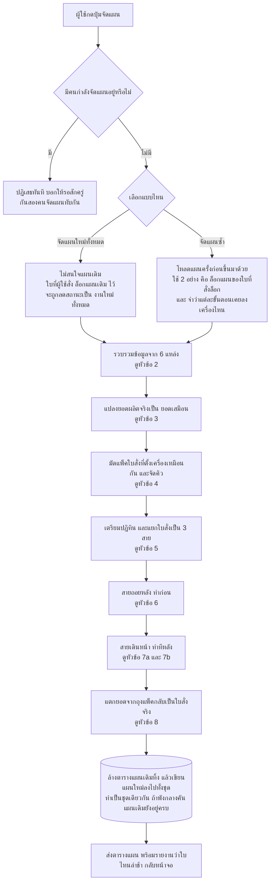
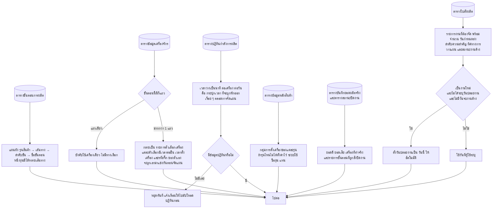
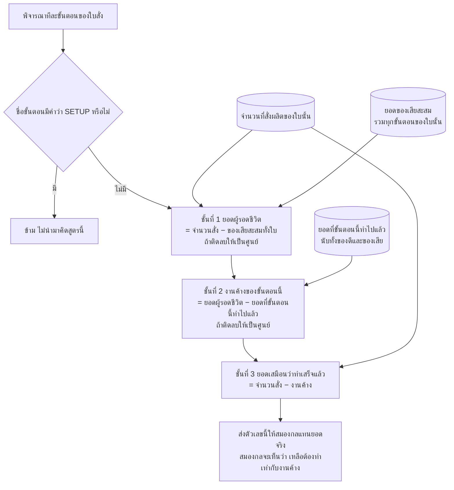
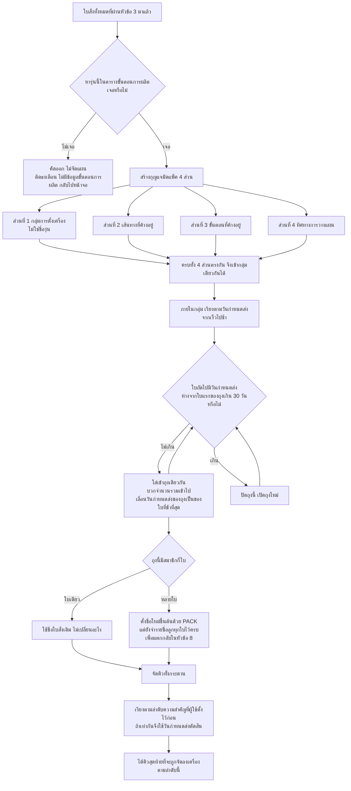
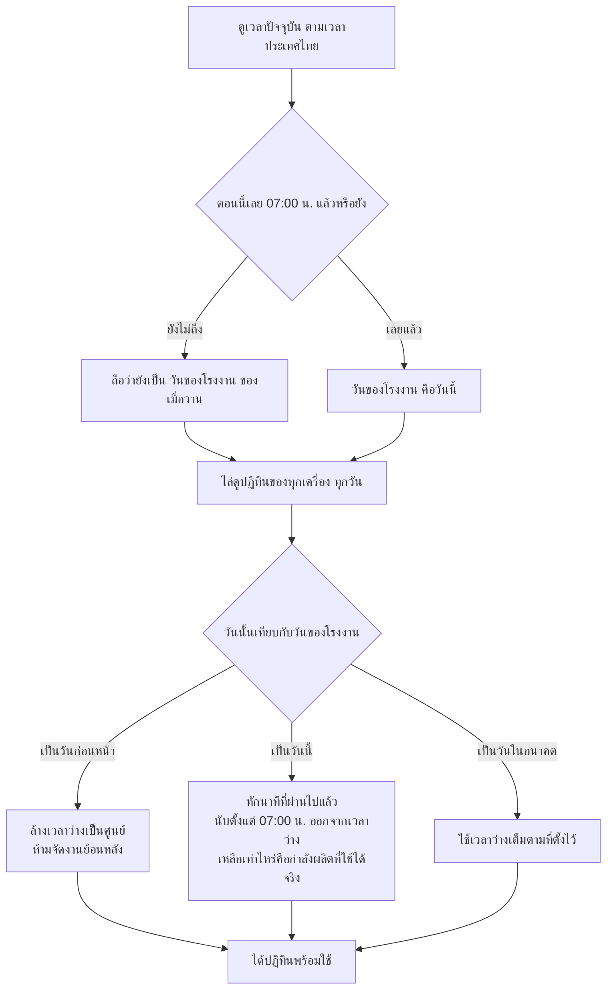
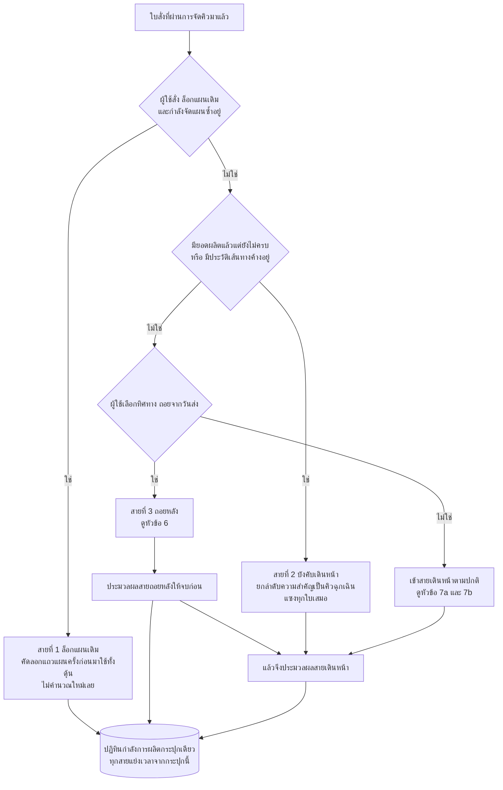
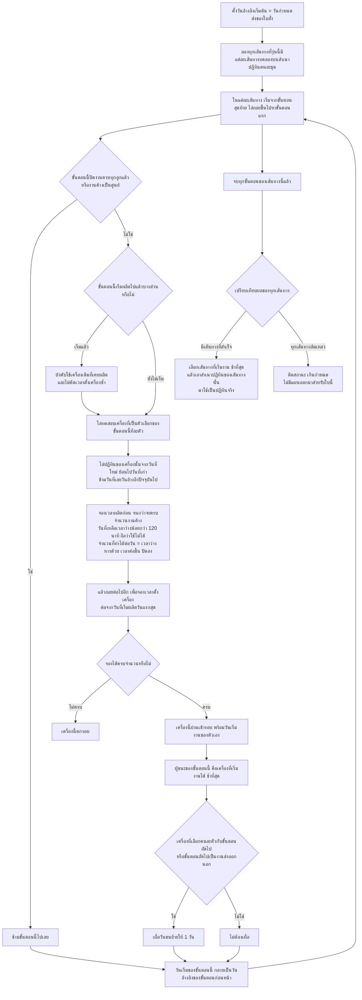
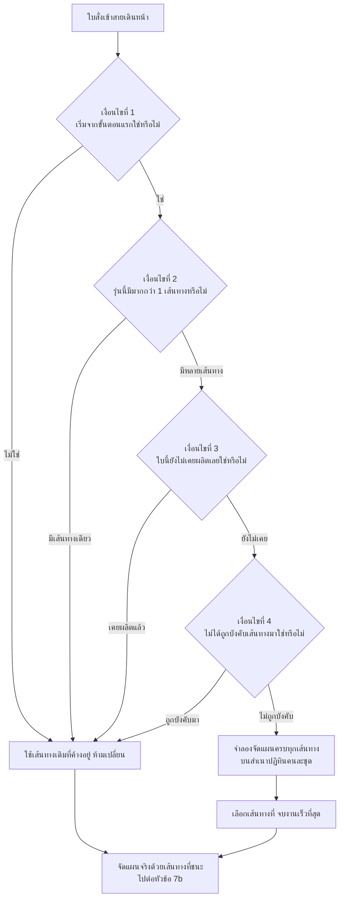
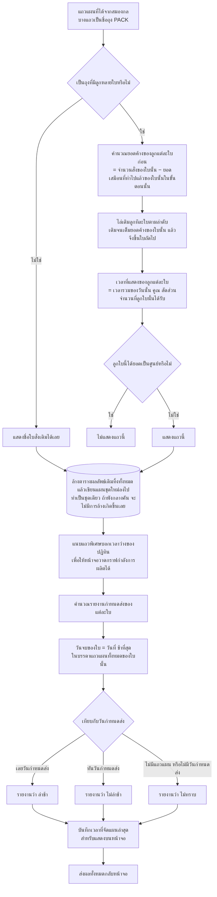

# กลไกการจัดตารางผลิต MSE Auto Plan (ระบบใหม่) — คำอธิบายแบบเห็นภาพ

เอกสารนี้อธิบาย **สิ่งที่ระบบคิดอยู่ข้างใน** ตั้งแต่ผู้ใช้กดปุ่มจัดแผน จนได้ตารางผลิตออกมาบนหน้าจอ
เขียนด้วยภาษาการทำงานจริงของโรงงาน ไม่ใช่ภาษาโปรแกรม

ทุกหัวข้อจะตอบ 3 คำถามเสมอ:

- **ตัวเลขนี้มาจากไหน** — ข้อมูลต้นทางคือตารางอะไร ใครเป็นคนป้อน
- **คิดยังไง** — สูตรหรือกติกาที่ใช้
- **มีผลอะไรต่อ** — ผลลัพธ์ไปเปลี่ยนอะไรในขั้นถัดไป

> **หมายเหตุสำคัญ:** นี่คือฉบับของ **ระบบใหม่** ที่ย้ายมาจากระบบเดิม
> **กติกาการวางแผนทุกข้อในหัวข้อ 1–8 ถูกยกมาทั้งดุ้น ผลลัพธ์ต้องออกมาเท่าเดิม** และมีชุดทดสอบ
> เทียบผลกับเครื่องคำนวณตัวเก่าคอยยืนยันอยู่ หมายเลขหัวข้อจึงตรงกับเอกสารของระบบเดิมทุกข้อ
> เปิดอ่านคู่กันทีละหัวข้อได้เลย
> ส่วนที่ **เปลี่ยนไปจริง ๆ** รวมไว้ที่หัวข้อ [ต่างจากระบบเก่ายังไง](#ต่างจากระบบเก่ายังไง) ท้ายเล่ม

> ถ้าต้องการรู้ว่าเรื่องไหนอยู่บรรทัดไหนของโค้ด ดูหัวข้อสุดท้าย **"แผนที่โค้ดสำหรับผู้ดูแลระบบ"**
> นั่นเป็นหัวข้อเดียวในเอกสารนี้ที่มีชื่อไฟล์และเลขบรรทัด

## สารบัญ

| # | หัวข้อ | ตอบคำถามว่า |
|---|---|---|
| 1 | [ภาพรวมตั้งแต่ต้นจนจบ](#1-ภาพรวมตั้งแต่ต้นจนจบ) | กดปุ่มแล้วเกิดอะไรขึ้นบ้าง |
| 2 | [ประกอบวัตถุดิบจาก 6 แหล่งข้อมูล](#2-ประกอบวัตถุดิบจาก-6-แหล่งข้อมูล) | ระบบใช้ข้อมูลอะไรบ้าง |
| 3 | [ยอดผู้รอดชีวิต และ ยอดเสมือน](#3-ยอดผู้รอดชีวิต-และ-ยอดเสมือน) | ของเสียต้นน้ำทำให้ปลายน้ำผลิตน้อยลงได้ยังไง |
| 4 | [มัดแพ็คใบสั่ง และจัดคิว](#4-มัดแพ็คใบสั่ง-และจัดคิว) | ทำไมแผนถึงโผล่ชื่อ PACK ขึ้นมา |
| 5 | [เตรียมปฏิทิน และแยกใบสั่งเป็น 3 สาย](#5-เตรียมปฏิทิน-และแยกใบสั่งเป็น-3-สาย) | ทำไมวันนี้ถึงจัดงานได้น้อย |
| 6 | [สายถอยหลัง](#6-สายถอยหลัง-ไล่จากวันกำหนดส่งย้อนขึ้นต้นน้ำ) | ระบบชนวันส่งพอดีได้ยังไง |
| 7a | [สายเดินหน้า ตอนเลือกเส้นทาง](#7a-สายเดินหน้า-ตอนเลือกเส้นทางผลิต) | ทำไมบางใบเปลี่ยนเส้นทางได้ บางใบเปลี่ยนไม่ได้ |
| 7b | [สายเดินหน้า ตอนไล่ทีละขั้นตอน](#7b-สายเดินหน้า-ตอนไล่ทีละขั้นตอน) | ทำไมระบบเลือกเครื่องนี้ วันนี้ |
| 8 | [แตกยอดกลับลอทลูก และบันทึกผล](#8-แตกยอดกลับลอทลูก-และบันทึกผล) | ตัวเลขบนหน้าจอคำนวณมาจากอะไร |
| — | [ตารางค่าคงที่](#ตารางค่าคงที่ทั้งหมด) · [ข้อสังเกตสำหรับผู้ดูแล](#ข้อสังเกตสำหรับผู้ดูแลระบบ) · [ต่างจากระบบเก่ายังไง](#ต่างจากระบบเก่ายังไง) · [แผนที่โค้ด](#แผนที่โค้ดสำหรับผู้ดูแลระบบ) | |

---

## 1. ภาพรวมตั้งแต่ต้นจนจบ

ระบบมีปุ่มจัดแผน **2 แบบ** ที่ต่างกันแค่ 2 จุด แต่ผลลัพธ์ต่างกันมาก

**ต่างกันตรงไหน**

| ประเด็น | จัดแผนใหม่ทั้งหมด | จัดแผนซ้ำ |
|---|---|---|
| ใบที่ผู้ใช้ตั้งไว้ว่า "ล็อกแผนเดิม" | ถูกลดสถานะเป็นงานใหม่ แผนเดิมไม่ถูกเคารพ | แผนเดิมถูกคัดลอกมาใช้ทั้งดุ้น ไม่คำนวณใหม่ |
| ความจำว่าขั้นตอนไหนเคยลงเครื่องไหน | ไม่มี ทุกขั้นตอนเปิดให้เครื่องแข่งกันใหม่ | มี ใช้ล็อกเครื่องของงานที่ผลิตไปแล้ว |
| ป้าย "ไม่มีข้อมูลขั้นตอนการผลิต" บนหน้าใบสั่ง | ล้างและประทับใหม่เฉพาะใบที่เพิ่งนำเข้า | ล้างและประทับใหม่ทุกใบที่ยังไม่ถูกลบ |

**ผลที่ตามมา:** ถ้าอยากให้แผนนิ่ง ไม่กระโดดไปมาทุกครั้งที่จัด ต้องใช้ "จัดแผนซ้ำ"
ส่วน "จัดแผนใหม่ทั้งหมด" ใช้เมื่อต้องการรื้อกระดานใหม่หมด

> **ใครกดได้บ้าง:** ปุ่มจัดแผนและจัดแผนซ้ำ เปิดให้เฉพาะ **ผู้ดูแลระบบ (ADMIN)** และ **ผู้วางแผน (PLANNER)**
> ส่วนการเปิดดูแผนล่าสุด ฝ่ายผลิต (MFG) ดูได้ด้วย — ระบบเดิมไม่มีการตรวจสิทธิ์ตรงนี้เลย

---

## 2. ประกอบวัตถุดิบจาก 6 แหล่งข้อมูล

ก่อนคำนวณอะไร ระบบจะดึงตารางข้อมูลหลักทั้งหมดมาแปลงเป็นตารางค้นหาในหน่วยความจำก่อน

**สรุปว่าอะไรมาจากไหน**

| ต้นทาง | กลายเป็นอะไร | มีผลต่อ |
|---|---|---|
| ตารางขั้นตอนการผลิต | ลำดับขั้นตอนของแต่ละรุ่น แยกตามเส้นทาง | เป็นโครงที่ทุกอย่างเดินตาม ถ้าหารุ่นไม่เจอ ใบนั้นถูกคัดออก |
| ตารางข้อมูลเครื่องจักร | ตัวเลือกเครื่อง เวลาต่อชิ้น เวลาตั้งเครื่อง รหัสจิ๊ก | เป็นตัวกำหนดว่าขั้นตอนนี้แข่งกันกี่เครื่อง และกินเวลาเท่าไหร่ |
| ตารางปฏิทินกำลังการผลิต | เวลาว่างรายเครื่องรายวัน | เป็นทรัพยากรจำกัดที่ทุกใบสั่งแย่งกัน ใครมาก่อนได้ก่อน |
| ตารางใบสั่งผลิต | รายการงาน | เป็นตัวตั้งของทุกการคำนวณ |
| ตารางข้อมูลหลักสินค้า | กลุ่มการตั้งเครื่อง | เป็นกุญแจมัดแพ็คในหัวข้อ 4 |
| บันทึกยอดผลิตจริง + สถานะปิดงาน | ยอดที่ทำแล้ว เครื่องที่ทำ งานที่ปิดแล้ว | ป้อนเข้าสูตรในหัวข้อ 3 และใช้ล็อกเครื่องในหัวข้อ 6 กับ 7b |

> **จุดที่มักงงกัน:** ขั้นตอนที่มีเครื่องให้เลือกหลายตัว กับขั้นตอนที่บังคับเครื่องเดียว
> ต่างกันแค่ "จำนวนแถวในตารางข้อมูลเครื่องจักรของขั้นตอนนั้น" เท่านั้น
> ถ้าอยากให้ขั้นตอนหนึ่งกระจายไปหลายเครื่องได้ ต้องเพิ่มแถวเข้าไป

> **"วันนี้" ที่ใช้ตั้งวันปล่อยงาน คือวันตามปฏิทินธรรมดา** ไม่ใช่ "วันของโรงงาน" ที่ตัดรอบ 07:00
> ในหัวข้อ 5 — สองที่นี้ใช้นิยามวันคนละแบบ และเป็นพฤติกรรมที่ยกมาจากระบบเดิมทั้งดุ้น

---

## 3. ยอดผู้รอดชีวิต และ ยอดเสมือน

**นี่คือส่วนที่เข้าใจยากที่สุดของทั้งระบบ** และเป็นคำตอบของคำถามว่า
*"ทำไมพอต้นน้ำมีของเสีย แผนของขั้นตอนปลายน้ำถึงลดจำนวนลงตามเองได้"*

### ปัญหาที่ต้องแก้

สมองกลจัดตารางรู้จักแค่ 2 ตัวเลขต่อขั้นตอน คือ **"สั่งเท่าไหร่"** กับ **"ทำไปแล้วเท่าไหร่"**
มันไม่มีแนวคิดเรื่อง "ของเสียที่ขั้นตอนก่อนหน้า" เลย

ดังนั้นแทนที่จะไปแก้สมองกล ระบบเลือกวิธี **โกหกตัวเลข "ทำไปแล้ว" ให้สมองกลแทน** —
ป้อน "ยอดเสมือนว่าทำเสร็จแล้ว" ที่คำนวณมาแล้วให้ ผลคือสมองกลจะจัดคิวขั้นตอนปลายน้ำ
น้อยลงเองโดยอัตโนมัติ เหมือนน้ำไหลลดหลั่นลงตามน้ำตก

### สูตร 3 ชั้น

### ตัวอย่างที่เกิดขึ้นจริง

ใบสั่งหนึ่ง สั่งผลิต **20 ชิ้น** มี 2 ขั้นตอน ขั้นตอนที่ 1 ทำไปแล้ว **ได้ดี 17 เสีย 3**
ขั้นตอนที่ 2 ยังไม่ได้เริ่มเลย

| | ขั้นตอนที่ 1 | ขั้นตอนที่ 2 |
|---|---|---|
| ยอดของเสียสะสมทั้งใบ | 3 | 3 |
| **ยอดผู้รอดชีวิต** = 20 − 3 | **17** | **17** |
| ยอดที่ขั้นตอนนี้ทำแล้ว ดี+เสีย | 17 + 3 = 20 | 0 |
| **งานค้าง** = ผู้รอดชีวิต − ทำแล้ว | 17 − 20 → ติดลบ → **0** | 17 − 0 = **17** |
| **ยอดเสมือน** = 20 − งานค้าง | 20 − 0 = **20** | 20 − 17 = **3** |
| สมองกลเห็นว่าเหลือต้องทำ | 20 − 20 = **0 ชิ้น** ✔ ปิดงาน | 20 − 3 = **17 ชิ้น** ✔ |

**อ่านผลลัพธ์:** ขั้นตอนที่ 1 ถูกมองว่าจบแล้ว ไม่ถูกจัดคิวอีก ส่วนขั้นตอนที่ 2 ถูกจัดคิวแค่ **17 ชิ้น**
ไม่ใช่ 20 — ของเสีย 3 ชิ้นที่หายไปตั้งแต่ต้นน้ำ ถูกหักออกจากภาระงานปลายน้ำโดยอัตโนมัติ

### ข้อควรรู้

- **ของเสียถูกนับรวมทั้งใบ ไม่ได้แยกรายขั้นตอน** — เสียที่ขั้นตอนไหนก็ตาม ทำให้ยอดที่ไหลต่อไป
  ลดลงทั้งสายเท่ากันหมด
- **ขั้นตอนที่มีคำว่า SETUP ในชื่อจะถูกข้าม** ไม่นำมาคิดสูตรนี้ เพราะไม่ใช่งานที่มีจำนวนชิ้น
- **ลำดับที่ไล่ขั้นตอนในสูตรนี้ ใช้ "หมายเลขเส้นทาง" ไม่ใช่ "ลำดับขั้น"** — เป็นลักษณะเฉพาะที่ยกมา
  จากระบบเดิมทั้งดุ้น ผลลัพธ์ของสูตรไม่ขึ้นกับลำดับอยู่แล้ว จึงคงไว้ให้ตรงกันเป๊ะ
- ตัวเลข "ยอดเสมือน" นี้จะถูกใช้ต่อในหัวข้อ 7b เพื่อเป็นเงื่อนไข "เคยผลิตแล้วหรือยัง"
  และในหัวข้อ 8 เพื่อคำนวณว่าลอทลูกแต่ละใบยังค้างอยู่เท่าไหร่

---

## 4. มัดแพ็คใบสั่ง และจัดคิว

ถ้าใบสั่ง 5 ใบใช้จิ๊กชุดเดียวกัน การจัดแยกกันจะเสียเวลาตั้งเครื่อง 5 รอบ ระบบจึงมัดรวมเป็นก้อนเดียว

**ประเด็นสำคัญ**

| ประเด็น | รายละเอียด |
|---|---|
| **กุญแจคือกลุ่มการตั้งเครื่อง ไม่ใช่ชื่อรุ่น** | ต่างรุ่นกันแต่ตั้งค่ากลุ่มการตั้งเครื่องตรงกัน ก็ถูกมัดรวมได้ ถ้าเห็นถุงหนึ่งมีหลายรุ่นปนกัน นั่นคือพฤติกรรมที่ตั้งใจ |
| **วันกำหนดส่งของถุงจะเลื่อนตามใบที่ช้าที่สุด** | และการวัดระยะ 30 วันวัดจาก **ใบแรกของถุง** ไม่ใช่ใบล่าสุด |
| **ถุงที่มีใบเดียวไม่เปลี่ยนชื่อ** | จะเห็นชื่อ PACK เฉพาะกรณีที่มัดได้จริงตั้งแต่ 2 ใบขึ้นไป |
| **ลำดับความสำคัญมาก่อนวันกำหนดส่งเสมอ** | ใบที่ตั้งลำดับความสำคัญสูง จะได้เลือกเครื่องและเวลาก่อน แม้วันส่งจะช้ากว่า |

---

## 5. เตรียมปฏิทิน และแยกใบสั่งเป็น 3 สาย

### ก. ปรับปฏิทินก่อนเริ่มจัด

นี่คือคำตอบของคำถามที่เจอบ่อยที่สุด — *"ทำไมวันนี้ระบบถึงจัดงานลงได้น้อยกว่าที่ตั้งไว้ในปฏิทิน"*

**ตัวอย่าง:** ถ้าเครื่องหนึ่งตั้งเวลาว่างวันนี้ไว้ 480 นาที แต่ตอนนี้เป็นเวลา 13:00 น.
เวลาที่ผ่านไปแล้วนับจาก 07:00 น. คือ 360 นาที → เวลาว่างที่ใช้จัดแผนได้เหลือ **120 นาที**

> **เวลาที่ใช้เป็นเวลาประเทศไทยเสมอ** ไม่ว่าเครื่องแม่ข่ายจะตั้งเขตเวลาไว้แบบไหน

### ข. แยกใบสั่งเข้า 3 สาย

**เหตุผลของแต่ละสาย**

| สาย | เข้าเมื่อไหร่ | ทำอะไร | ทำไม |
|---|---|---|---|
| ล็อกแผนเดิม | ผู้ใช้ตั้งไว้ + กำลังจัดแผนซ้ำ | คัดลอกแผนเดิม | ผู้ใช้ยืนยันแผนนี้กับลูกค้าไปแล้ว ห้ามเปลี่ยน |
| บังคับเดินหน้า | เริ่มผลิตไปแล้วบางส่วน หรือมีงานค้างในสาย | เดินหน้าเสมอ + คิวฉุกเฉินลำดับสูงสุด | งานที่ลงมือไปแล้วย้อนเวลากลับไปเริ่มใหม่ไม่ได้ ต้องจองกำลังผลิตให้ก่อนใคร |
| ถอยหลัง | ผู้ใช้เลือกทิศทางถอยจากวันส่ง | คำนวณย้อนจากวันกำหนดส่ง | ต้องการชนวันส่งพอดี ไม่ผลิตดักหน้าเป็นสต็อก |
| เดินหน้า | นอกจากนั้นทั้งหมด | คำนวณจากวันปล่อยงานไปข้างหน้า | ต้องการเสร็จเร็วที่สุดเท่าที่กำลังผลิตเอื้อ |

> ⚠️ **สายถอยหลังถูกประมวลผลก่อนสายเดินหน้าเสมอ** และทั้งสองสายหักเวลาจากปฏิทินกระปุกเดียวกัน
> ผลคือ **ใบที่มาก่อนได้เลือกก่อน** การสลับลำดับความสำคัญของใบสั่งเพียงใบเดียว
> อาจทำให้แผนเปลี่ยนทั้งกระดาน

---

## 6. สายถอยหลัง ไล่จากวันกำหนดส่งย้อนขึ้นต้นน้ำ

เป้าหมายคือ **"เริ่มงานให้ช้าที่สุดเท่าที่ยังทันวันส่ง"** เพื่อไม่ให้ของค้างสต็อก

**ตรรกะ "ช้าที่สุดชนะ" อธิบายยังไง**

ในสายถอยหลัง เป้าหมายไม่ใช่เสร็จเร็ว แต่คือ **เสร็จพอดีวันส่ง** ถ้ามีเครื่องให้เลือก 2 ตัว
ตัวหนึ่งเริ่มได้วันที่ 1 อีกตัวเริ่มได้วันที่ 10 และทั้งคู่ทันวันส่งเหมือนกัน
ระบบเลือกตัวที่เริ่มวันที่ 10 เพราะ **ปล่อยกำลังผลิตช่วงต้นไว้ให้งานอื่นที่เร่งกว่า**
และวัตถุดิบไม่ต้องออกจากคลังเร็วเกินจำเป็น

**ผลที่ตามมา**

- สำเนาปฏิทินของเส้นทางที่ชนะ **ถูกยกมาแทนปฏิทินจริงทั้งชุด** ดังนั้นเวลาที่เส้นทางที่แพ้จองไว้
  จะถูกคืนกลับไปโดยอัตโนมัติ
- ใบที่ติดสถานะ "เกินกำหนด" จะไม่มีแถวแผนเลย ต้องแก้ด้วยการขยับวันส่ง เพิ่มกำลังผลิตในปฏิทิน
  หรือลดจำนวน
- งานส่งออกนอกและงานอบชุบในสายนี้ ถูกไล่ย้อนตามรอบรถ **จันทร์ / พุธ / ศุกร์** เช่นเดียวกับสายเดินหน้า

---

## 7a. สายเดินหน้า ตอนเลือกเส้นทางผลิต

ระบบ **ไม่ได้** ยอมให้ทุกใบเลือกเส้นทางใหม่ เงื่อนไขเข้มมาก

**เหตุผลของแต่ละเงื่อนไข**

| เงื่อนไข | ทำไมต้องมี |
|---|---|
| เริ่มจากขั้นตอนแรก | ถ้างานเดินไปกลางทางแล้ว การเปลี่ยนเส้นทางแปลว่าของที่ทำไปแล้วใช้ไม่ได้ |
| มีมากกว่า 1 เส้นทาง | ไม่มีอะไรให้เลือก ก็ไม่ต้องเสียเวลาจำลอง |
| ยังไม่เคยผลิตเลย | ถ้ามียอดผลิตแล้วแม้ชิ้นเดียว แปลว่าเส้นทางถูกเลือกไปแล้วในชีวิตจริง |
| ไม่ได้ถูกบังคับเส้นทาง | ผู้ใช้ระบุเส้นทางมาเอง ระบบต้องเคารพ |

> **ต่างจากสายถอยหลัง:** สายถอยหลังเลือกเส้นทางที่ **เริ่มช้าที่สุด**
> ส่วนสายเดินหน้าเลือกเส้นทางที่ **จบเร็วที่สุด** — เพราะเป้าหมายคนละอย่างกัน

> ถ้าจำลองแล้วไม่มีเส้นทางไหนสำเร็จเลย ระบบจะถอยไปใช้ **เส้นทางแรกของรุ่นนั้น**

---

## 7b. สายเดินหน้า ตอนไล่ทีละขั้นตอน

นี่คือส่วนที่ตอบคำถาม *"ทำไมระบบถึงเอางานนี้ไปลงเครื่องนี้ ในวันนี้"*

```mermaid
flowchart TD
    ST["วันเริ่มต้นของใบสั่ง<br/>= วันที่ ช้ากว่า ระหว่าง วันแรกที่ปฏิทินเปิด กับ วันปล่อยงานของใบสั่ง"] --> LOOP["ไล่ทีละขั้นตอน จากต้นไปปลาย"]

    LOOP --> GAP{"เทียบกับขั้นตอนก่อนหน้า"}
    GAP -->|"เปลี่ยนเครื่อง หรือขั้นตอนก่อนเป็นงานส่งออกนอก"| GAP1["เริ่มขั้นตอนนี้ที่ วันจบของขั้นตอนก่อน บวก 1 วัน"]
    GAP -->|"เครื่องเดิม"| GAP2["เริ่มขั้นตอนนี้ที่ วันจบของขั้นตอนก่อน"]

    GAP1 --> MLOCK{"กฎล็อกเครื่อง<br/>ขั้นตอนนี้ผลิตไปแล้วบางส่วนหรือไม่"}
    GAP2 --> MLOCK
    MLOCK -->|"ผลิตแล้ว"| ML1["บังคับใช้เครื่องเดิมที่เคยผลิต ห้ามย้าย<br/>หาจากบันทึกยอดผลิตจริงก่อน<br/>ถ้าไม่เจอจึงหาจากแผนครั้งก่อน"]
    MLOCK -->|"ยังไม่เคยผลิต"| ML2["เปิดให้ทุกเครื่องที่เป็นตัวเลือกแข่งกัน"]

    ML1 --> SU
    ML2 --> SU
    SU{"กฎล้างเวลาตั้งเครื่อง<br/>งานคาเครื่องอยู่ หรือ เคยผลิตแล้ว<br/>หรือ เป็นขั้นตอนเริ่มของงานค้างที่นำเข้ามา"}
    SU -->|"เข้าเงื่อนไขข้อใดข้อหนึ่ง"| SU1["ไม่คิดเวลาตั้งเครื่องเลย<br/>เพราะตั้งไปแล้วในชีวิตจริง"]
    SU -->|"ไม่เข้าเลย"| SU2{"งานล่าสุดบนเครื่องนั้น<br/>ใช้จิ๊กตัวเดียวกันหรือไม่"}
    SU2 -->|"จิ๊กเดียวกัน"| SU3["คิดเวลาตั้งเครื่องแบบประหยัด<br/>เพียง 40 นาที หรือค่าจริงถ้าน้อยกว่า"]
    SU2 -->|"คนละจิ๊ก"| SU4["คิดเวลาตั้งเครื่องเต็มตามตารางเครื่องจักร"]

    SU1 --> TYPE
    SU3 --> TYPE
    SU4 --> TYPE
    TYPE{"ขั้นตอนนี้เป็นงานที่คิดเป็นวันหรือไม่<br/>เช่น ส่งออกนอก หรือ อบชุบ"}

    TYPE -->|"ใช่"| DAY["ไม่กินเวลาปฏิทินเลย<br/>ใช้ช่องเวลาต่อชิ้นเป็น จำนวนวันรอคอย แทน<br/>งานอบชุบต้องส่งและรับตรงรอบรถ จันทร์ พุธ ศุกร์ เท่านั้น"]
    TYPE -->|"ไม่ใช่"| MIN["ไล่จองปฏิทินไปข้างหน้าทีละวัน"]

    MIN --> F{"วันนั้นมีเวลาว่างถึง 120 นาทีหรือไม่"}
    F -->|"ไม่ถึง"| F1["ถือว่าวันนั้นใช้ไม่ได้ ข้ามไป<br/>กันเศษเวลาที่ทำอะไรไม่ได้จริง"]
    F -->|"ถึง"| F2["ใส่เวลาตั้งเครื่องให้ครบก่อน<br/>เวลาที่เหลือ หารด้วย เวลาต่อชิ้น ปัดลง<br/>= จำนวนที่ผลิตได้ในวันนั้น"]
    F1 --> RE
    F2 --> RE
    RE{"กฎตั้งเครื่องใหม่<br/>งานขาดช่วงเกิน 1 วัน<br/>และช่วงที่ขาดนั้นเครื่องมีเวลาว่าง"}
    RE -->|"ใช่ แปลว่ามีงานอื่นแทรก"| RE1["ต้องตั้งเครื่องใหม่ทั้งหมด<br/>คิดเวลาตั้งเครื่องเต็มอีกรอบ"]
    RE -->|"ไม่ใช่"| RE2["ทำต่อได้เลย"]

    RE1 --> DONE
    RE2 --> DONE
    DAY --> DONE
    DONE{"เครื่องนี้จองครบจำนวนหรือไม่"}
    DONE -->|"ไม่ครบ"| NOCAP["เครื่องนี้ตกรอบ"]
    DONE -->|"ครบ"| CAND["เข้ารอบ พร้อมวันจบงานของตัวเอง"]

    CAND --> WIN["ผู้ชนะเบื้องต้น = เครื่องที่ จบงานเร็วที่สุด"]
    WIN --> STICK{"กติกาติดเครื่องเดิม<br/>เครื่องที่ขั้นตอนก่อนหน้าใช้อยู่<br/>จบงานได้ ในวันเดียวกัน กับผู้ชนะหรือไม่"}
    STICK -->|"จบวันเดียวกัน"| STICK1["เปลี่ยนไปเลือกเครื่องเดิมแทน<br/>ประหยัดการขนย้ายและการตั้งเครื่อง"]
    STICK -->|"จบคนละวัน"| STICK2["ใช้ผู้ชนะเดิม"]

    STICK1 --> APPLY
    STICK2 --> APPLY
    APPLY["หักเวลาออกจากปฏิทินจริง<br/>จำจิ๊กล่าสุดของเครื่องนั้นไว้<br/>บันทึกวันจบและเครื่องไว้ให้ขั้นตอนถัดไป"]
    APPLY --> LOOP

    NOCAP --> ALLFAIL{"ทุกเครื่องตกรอบหมดหรือไม่"}
    ALLFAIL -->|"ใช่"| ERR["ออกแถวสถานะ ไม่มีกำลังผลิต<br/>งานนี้ถูกทิ้ง ไม่มีแผน"]
    ALLFAIL -->|"ไม่"| WIN
```

### กฎที่ต้องเข้าใจให้ลึก

**1. เวลาต่อชิ้นของงานส่งออกนอก ไม่ใช่นาทีต่อชิ้น**

สำหรับขั้นตอนกลุ่ม "คิดเป็นวัน" (ส่งออกนอก อบชุบ ฯลฯ) ช่องเดียวกันที่ปกติเก็บ "เวลาต่อชิ้นเป็นนาที"
จะถูกอ่านเป็น **"จำนวนวันรอคอย"** แทน ถ้าใส่เลข 3 หมายถึงรอ 3 วัน ไม่ใช่ 3 นาทีต่อชิ้น
**นี่เป็นจุดที่ป้อนข้อมูลผิดได้ง่ายที่สุด**

**2. กติกาติดเครื่องเดิม ทำงานเฉพาะกรณีจบวันเดียวกัน**

ระบบเปรียบเทียบเวลาจบงานในหน่วย **"วัน"** แต่ตั้งเกณฑ์ผ่อนผันไว้ในหน่วย "ชั่วโมง"
ผลจริงคือ กติกานี้จะเปลี่ยนผู้ชนะได้ **ก็ต่อเมื่อเครื่องเดิมกับผู้ชนะจบงานวันเดียวกันเป๊ะ** เท่านั้น
ถ้าเครื่องเดิมจบช้ากว่าแม้แต่ 1 วัน กติกานี้จะไม่ทำงาน

**3. วันที่มีเวลาว่างน้อยกว่า 120 นาที ถือว่าใช้ไม่ได้**

ไม่ใช่บั๊ก แต่เป็นการกันเศษเวลาที่ในความเป็นจริงทำอะไรไม่ได้ — ตั้งเครื่องยังไม่ทันเสร็จก็หมดกะแล้ว
ถ้าเห็นเครื่องว่าง 90 นาทีแล้วระบบไม่ยอมลงงาน นี่คือสาเหตุ

**4. กฎล้างเวลาตั้งเครื่อง สำคัญต่อความแม่นของแผน**

งานที่คาเครื่องอยู่จริงในโรงงาน ตั้งเครื่องไปแล้วในชีวิตจริง ถ้าระบบยังคิดเวลาตั้งเครื่องซ้ำ
แผนจะเลื่อนออกไปโดยไม่มีเหตุผล กฎนี้ตรวจ 3 ทาง คือ งานคาเครื่อง / มียอดผลิตแล้ว /
เป็นขั้นตอนเริ่มของงานค้างที่ผู้ใช้นำเข้ามา เข้าข้อใดข้อหนึ่งก็ล้างทิ้งทันที

**5. ตอนจำลองหาเส้นทาง ไม่คิดส่วนลดเวลาตั้งเครื่อง**

การจำลองในหัวข้อ 7a คิดเวลาตั้งเครื่องเต็มเสมอ ส่วนลด 40 นาทีจะถูกคิดตอนจัดแผนจริงเท่านั้น
เพราะตอนจำลองยังไม่รู้ว่าจิ๊กตัวล่าสุดบนเครื่องจะเป็นตัวไหน

---

## 8. แตกยอดกลับลอทลูก และบันทึกผล

แผนที่ได้จากหัวข้อ 6 และ 7 ยังเป็นชื่อถุง `PACK-` อยู่ ต้องแตกกลับเป็นใบสั่งจริงก่อนแสดงผล

### ตัวอย่างการแตกยอด

ถุงหนึ่งมีลูก 3 ใบ ยอดค้าง 10 / 15 / 8 ชิ้น ตามลำดับ วันหนึ่งสมองกลจัดให้ถุงนี้ผลิตได้ **20 ชิ้น**
ใช้เวลารวม 400 นาที

| ลูก | ยอดค้าง | ได้รับวันนี้ | เวลาที่แสดง |
|---|---|---|---|
| ใบที่ 1 | 10 | **10** เต็มยอด | 400 × 10÷20 = **200 นาที** |
| ใบที่ 2 | 15 | **10** ที่เหลือ | 400 × 10÷20 = **200 นาที** |
| ใบที่ 3 | 8 | **0** | ไม่แสดงแถว |

วันถัดไป ใบที่ 2 จะเริ่มจากยอดค้างที่เหลือ 5 ชิ้น แล้วจึงไหลต่อไปใบที่ 3

> **ข้อควรระวัง:** ตารางผลลัพธ์ถูก **ล้างทิ้งทั้งหมดแล้วเขียนใหม่** ทุกครั้งที่จัดแผน
> ไม่มีการเก็บประวัติแผนเก่า ถ้าต้องการเปรียบเทียบแผนก่อนหลัง ต้องส่งออกเก็บไว้เอง

> **เปิดหน้าแผนใหม่ทีหลังก็เห็นกราฟกำลังผลิตเหมือนเดิม** — ตอนโหลดแผนล่าสุดขึ้นมาแสดง
> ระบบแนบแถวพิเศษบอกเวลาว่างของปฏิทินไปให้ด้วยเสมอ (ระบบเดิมไม่แนบ ดูหัวข้อความต่างท้ายเล่ม)

---

## ตารางค่าคงที่ทั้งหมด

ตัวเลขทุกตัวที่ปรากฏในไดอะแกรมข้างบน สืบกลับมาที่ตารางนี้ได้
**ค่าเหล่านี้แก้ได้จากไฟล์ตั้งค่าโดยไม่ต้องแก้โค้ด** — ระบบเดิมฝังไว้ในโค้ดอย่างเดียว

| ค่า | ตัวเลข | ความหมาย | ใช้ที่ไหน | ตั้งค่าใหม่ได้ที่ |
|---|---|---|---|---|
| เศษเวลาขั้นต่ำที่ใช้งานได้ | **120 นาที** | วันที่เหลือเวลาว่างน้อยกว่านี้ ถือว่าใช้ไม่ได้ | หัวข้อ 6, 7b | `SCHED_MIN_FRAGMENT_TIME` |
| เวลาตั้งเครื่องแบบประหยัด | **40 นาที** | ใช้เมื่องานก่อนหน้าบนเครื่องเดียวกันใช้จิ๊กตัวเดียวกัน หรือใช้ค่าจริงถ้าน้อยกว่า | หัวข้อ 7b | `SCHED_MINOR_SETUP_MIN` |
| เกณฑ์ผ่อนผันเปลี่ยนเครื่อง | **60 นาที** | ผลจริงคือทำงานเฉพาะกรณีจบวันเดียวกัน — ดูคำอธิบายข้อ 2 ของหัวข้อ 7b | หัวข้อ 7b | `SCHED_SWITCH_PENALTY_MIN` |
| ช่วงมัดแพ็ค | **30 วัน** | ระยะห่างวันกำหนดส่งสูงสุดที่ยังมัดรวมถุงเดียวกันได้ วัดจากใบแรกของถุง | หัวข้อ 4 | `SCHED_PACK_WINDOW_DAYS` |
| รอบรถขนส่งงานอบชุบ | **จันทร์ / พุธ / ศุกร์** | วันส่งและวันรับต้องตรงรอบเท่านั้น | หัวข้อ 6, 7b | `SCHED_LOGISTIC_WEEKDAYS` |
| เริ่มวันของโรงงาน | **07:00 น.** | ก่อนเวลานี้ยังนับเป็นวันของเมื่อวาน | หัวข้อ 5 | `FACTORY_DAY_START_HOUR` |
| คิวฉุกเฉินของงานค้าง | **ลำดับ −999** | งานที่เริ่มผลิตแล้วจะแซงทุกใบเสมอ | หัวข้อ 5 | — (ฝังในโค้ด) |
| กลุ่มงานที่คิดเป็นวัน | **คำสำคัญ 8 คำ** | คำที่ใช้เทียบเป็นภาษาอังกฤษตามชื่อเครื่องจริง — `PREPARE-OUTSOURCE` (จัดเตรียมส่งนอก), `OUTSOURCE` (ส่งนอก), `HEAT-TREATMENT` (อบชุบ), `HEAT_JUTAWAN` (อบชุบจุฑาวรรณ), `DEBURR-INSEPC` (ลบคม-ตรวจ), `BLACKENING_CCS` (รมดำ), `OQC` (ตรวจสอบขั้นสุดท้าย), `ROUGH_TURNING_CCS` (กลึงหยาบ) | หัวข้อ 6, 7b | `SCHED_DAY_UNIT_KEYWORDS` |
| เปิด/ปิด การมัดแพ็ค | **เปิด** | ปิดแล้วทุกใบสั่งจะถูกจัดแยกกันหมด | หัวข้อ 4 | `SCHED_ENABLE_PACKING` |
| เปิด/ปิด กติกาติดเครื่องเดิม | **เปิด** | ปิดแล้วจะไม่เผื่อวันขนย้ายและไม่ดึงกลับเครื่องเดิม | หัวข้อ 6, 7b | `SCHED_ENABLE_STICKINESS` |
| เปิด/ปิด แผนละเอียดงานอบชุบ | **เปิด** | ปิดแล้วงานอบชุบจะคิดแบบวันรอคอยธรรมดา ไม่อิงรอบรถ | หัวข้อ 6, 7b | `SCHED_ENABLE_HEAT_DEEP_PLAN` |

ชื่อเครื่องที่ **มีคำสำคัญเหล่านี้อยู่ในชื่อ** จะถูกจัดเป็นงานที่คิดเป็นวันโดยอัตโนมัติ
ไม่ต้องตั้งค่าเพิ่ม — และนั่นแปลว่า **การตั้งชื่อเครื่องมีผลต่อวิธีคำนวณ**

> ⚠️ **การแก้ค่าเหล่านี้เปลี่ยนผลลัพธ์ทั้งกระดาน** และทำให้ผลไม่ตรงกับระบบเดิมอีกต่อไป
> ควรแก้เมื่อตั้งใจจริงเท่านั้น ค่าเริ่มต้นทั้งหมดตรงกับระบบเดิมเป๊ะ

---

## ข้อสังเกตสำหรับผู้ดูแลระบบ

รายการต่อไปนี้เป็นข้อสังเกตเชิงพฤติกรรมที่พบจากการอ่านตรรกะ ไม่ใช่การฟันธงว่าเป็นข้อผิดพลาด
แต่เป็นจุดที่ควรตรวจสอบว่าตรงกับเจตนาที่ออกแบบไว้หรือไม่
**ทั้ง 3 ข้อนี้ยกมาจากระบบเดิมทั้งหมดโดยตั้งใจ** เพื่อให้ผลลัพธ์ตรงกันระหว่างช่วงเปลี่ยนระบบ

**1. การคืนเวลาให้ใบที่ล็อกแผน**

ตอนจัดแผนซ้ำ ระบบจะ *เพิ่ม* เวลาที่ใบล็อกแผนเคยใช้ **กลับเข้าปฏิทิน** แล้วคัดลอกแถวแผนเดิม
มาใช้ **โดยไม่หักเวลาออกอีกครั้ง** ผลคือกำลังการผลิตของวันนั้นในการคำนวณ จะมากกว่าที่ตั้งไว้
ในปฏิทินต้นทาง → ควรตรวจสอบว่าตั้งใจให้ใบที่ล็อกแผน "ไม่กินโควตา" หรือไม่

**2. วันแรกที่ปฏิทินเปิด คิดจากเครื่องตัวเดียว**

ค่า "วันแรกที่ปฏิทินเปิด" ที่ใช้เป็นวันเริ่มต้นของสายเดินหน้า ถูกคำนวณจาก **เครื่องตัวแรก
ที่เจอในปฏิทินเท่านั้น** ไม่ได้มองครบทุกเครื่อง → ถ้าเครื่องแต่ละตัวมีช่วงวันที่ในปฏิทินไม่เท่ากัน
ผลอาจเพี้ยนได้

**3. ลำดับการประมวลผลเปลี่ยนผลลัพธ์ทั้งกระดาน**

สายถอยหลังกินกำลังการผลิตก่อนสายเดินหน้า และภายในสายเดียวกัน ใบที่คิวมาก่อนได้เลือกเครื่องก่อน
นอกจากนี้ระบบยังจำจิ๊กล่าสุดของแต่ละเครื่องข้ามใบสั่ง (สำหรับคิดเวลาตั้งเครื่องแบบประหยัด)
→ **การสลับลำดับความสำคัญของใบเดียว อาจทำให้แผนเปลี่ยนทั้งกระดาน** ไม่ใช่ความไม่เสถียรของระบบ

> ข้อสังเกตข้อ 4 ของเอกสารระบบเดิม (โค้ดเวอร์ชันเก่าที่ถูกคอมเมนต์ทิ้ง วางติดกับโค้ดที่ทำงานจริง)
> **ไม่มีแล้วในระบบใหม่** — ตอนย้ายระบบไม่ได้ยกโค้ดส่วนนั้นมาด้วย

---

## ต่างจากระบบเก่ายังไง

**สรุปหนึ่งบรรทัด:** ตรรกะการวางแผนทั้งหมด (หัวข้อ 1–8) **ไม่เปลี่ยน** สิ่งที่เปลี่ยนคือชั้นที่ห่อ
เครื่องคำนวณอยู่ — ความปลอดภัยของข้อมูล สิทธิ์การใช้งาน และความแม่นของสิ่งที่ส่งกลับหน้าจอ

### กลุ่ม ก. พฤติกรรมที่จงใจแก้ (เห็นผลกับผู้ใช้)

| เรื่อง | ระบบเก่า | ระบบใหม่ |
|---|---|---|
| **กราฟกำลังผลิตหลังรีเฟรชหน้า** | ตอนโหลดแผนล่าสุด ไม่ส่งแถวเวลาว่างของปฏิทินมาด้วย → หัวตารางกำลังผลิตตกไปใช้ค่าเริ่มต้น ไม่ตรงของจริง | ส่งแถวเวลาว่างมาด้วยเสมอ หน้าจอจึงเหมือนกันทั้งตอนเพิ่งจัดแผนและตอนเปิดใหม่ |
| **ล้างและเขียนตารางแผน** | ล้าง 2 รอบ และไม่ได้ทำเป็นชุดเดียว ถ้าพังกลางคัน **ตารางแผนหายทั้งตาราง** | ล้างและเขียนเป็นชุดเดียวกัน พังกลางคัน = ไม่มีอะไรเปลี่ยน แผนเดิมยังอยู่ครบ |
| **กดจัดแผนพร้อมกัน 2 คน** | รันซ้อนกันได้ ผลปนกัน | คนที่สองถูกปฏิเสธพร้อมข้อความให้รอสักครู่ |
| **สิทธิ์การใช้งาน** | ทุกคนที่เข้าถึงระบบได้ กดจัดแผนได้หมด (ไม่มีการตรวจสิทธิ์เลย) | จัดแผน/จัดแผนซ้ำ = ADMIN, PLANNER เท่านั้น · ดูแผนล่าสุด = ADMIN, PLANNER, MFG |
| **รายงานกำหนดส่งตอนเปิดแผนเก่า** | ดึงข้อมูลใบสั่งทีละใบ | ดึงรอบเดียวทั้งตาราง ผลลัพธ์เท่าเดิม แต่เร็วกว่ามากเมื่อมีใบสั่งเยอะ |

### กลุ่ม ข. โครงสร้างภายในที่เปลี่ยน (พฤติกรรมเท่าเดิม)

- **นาฬิกาเดียวทั้งระบบ ตรึงเป็นเวลาประเทศไทย** ไม่ขึ้นกับเขตเวลาของเครื่องแม่ข่าย และเครื่อง
  คำนวณ **ถูกบังคับให้รับเวลาจากภายนอกเสมอ ห้ามไปดูนาฬิกาเอง** (ระบบเดิมถ้าไม่ส่งเวลาให้
  จะแอบไปดูนาฬิกาเครื่อง) → ทดสอบซ้ำกี่รอบก็ได้ผลเดิม
- **ค่าคงที่ทั้งหมดย้ายออกมาไว้ที่เดียว** ปรับได้จากไฟล์ตั้งค่า ไม่ต้องแก้โค้ด (ดูคอลัมน์ขวาสุด
  ของตารางค่าคงที่) — ระบบเดิมฝังตัวเลขไว้กลางโค้ด
- **เครื่องคำนวณถูกแยกออกจากฐานข้อมูลและนาฬิกาโดยสิ้นเชิง** ส่วนที่คุยกับฐานข้อมูลอยู่คนละไฟล์
  ทำให้ทดสอบตรรกะการวางแผนได้โดยไม่ต้องต่อฐานข้อมูลโรงงาน
- **โครงสร้างข้อมูลบางตัวต้องคงลำดับการใส่ไว้เป๊ะ ๆ** (เช่นการเลือก "เส้นทางแรก" ของรุ่น) เพราะ
  ภาษาใหม่จะจัดเรียงคีย์ที่เป็นตัวเลขใหม่เองโดยอัตโนมัติ ถ้าไม่ระวังจุดนี้ ผลลัพธ์จะเพี้ยนแบบเงียบ ๆ
  โดยไม่มีข้อความผิดพลาดใด ๆ — เป็นกับดักอันดับหนึ่งของการย้ายระบบนี้
- **โค้ดเวอร์ชันเก่าที่ถูกคอมเมนต์ทิ้งไว้ ไม่ถูกยกมาด้วย** รวมถึงไฟล์สำรองทั้งไฟล์ของระบบเดิม
- **มีชุดทดสอบเทียบผลกับเครื่องคำนวณตัวเก่า** โดยใช้ข้อมูลตัวอย่างที่ดัมพ์ออกมาจากระบบเดิม
  — นี่คือหลักฐานว่าหัวข้อ 1–8 ยังให้ผลตรงกัน และคือสิ่งที่ต้องรันทุกครั้งที่แตะเครื่องคำนวณ

### กลุ่ม ค. ลักษณะเฉพาะที่ตั้งใจคงไว้ (อย่าเผลอ "แก้")

จุดเหล่านี้ดูเหมือนข้อผิดพลาดเมื่ออ่านโค้ด แต่ถูกคงไว้ **โดยเจตนา** เพื่อให้ผลลัพธ์ตรงกับระบบเดิม
ถ้าจะแก้ ต้องแก้พร้อมกับยอมรับว่าแผนจะเปลี่ยนไปจากเดิม:

- ใบที่ล็อกแผน คืนเวลาเข้าปฏิทินแล้วไม่หักออกซ้ำ (ข้อสังเกตข้อ 1)
- "วันแรกที่ปฏิทินเปิด" คิดจากเครื่องตัวแรกตัวเดียว (ข้อสังเกตข้อ 2)
- สายถอยหลังกินกำลังผลิตก่อนสายเดินหน้า และจำจิ๊กล่าสุดข้ามใบสั่ง (ข้อสังเกตข้อ 3)
- ตอนอ่านแผนครั้งก่อน ระบบลองอ่านวันที่ในรูปแบบ วัน/เดือน/ปี ก่อน ถ้าไม่ตรงจึงใช้ค่าเดิม
- สูตรยอดเสมือน (หัวข้อ 3) ไล่ขั้นตอนตามหมายเลขเส้นทาง ไม่ใช่ลำดับขั้น
- "วันนี้" ที่ใช้ตั้งวันปล่อยงาน เป็นวันตามปฏิทิน ไม่ใช่วันของโรงงานที่ตัดรอบ 07:00
- ข้อความแจ้งผลบนหน้าจอ ยังใช้ถ้อยคำเดิมทุกตัวอักษร รวมถึงสถานะของแต่ละใบสั่ง

---

## ฟีเจอร์ Mat'l Receive / Confirm Date / Simulation (พอร์ตทีหลัง)

พอร์ตจาก `OLD_BACKUP` commit `4cc70eb` — **ฝั่ง backend (schema + endpoint) ของ commit นั้นไม่เคยถูกเขียน** จึง reconstruct ใหม่
เพิ่มทับกลไกเดิม **โดยไม่แตะการล็อก FIXED** (ระบบใหม่ยังคง FIXED lock ต่างจากซอร์สที่ลบทิ้ง)

- **วันวัตถุดิบเข้า (Material)** — `effectiveReadyDate = max(release_date, material_ready_date)` (เทียบ string) กลายเป็น
  "วันเริ่มหาคิว" ของสายเดินหน้า (หัวข้อ 7b) แทนที่จะใช้ `release_date` อย่างเดียว. หลังวางแผนเสร็จ ระบบเทียบวันเริ่มจริง
  (`start_date`) กับ `material_ready_date` แล้วเขียน `program_notes` = `Please pull in material` / `Material enough` / `N/A`
  พร้อม `start_date`/`fg_date` กลับตาราง `orders` (เฉพาะตอน**ไม่ใช่** simulation)
- **วัน Confirm (VIP)** — ถ้ามี `confirm_reply_date` จะ (1) สวมรอยเป็น `dueDate`, (2) จัดคิวขึ้นก่อนงานปกติ (`vipScore=0`
  ในหัวข้อ 4), (3) มัดแพ็ครวมเฉพาะงาน confirm วันเดียวกัน (คีย์แพ็คได้ `CLASS:VIP:<date>`)
- **มียอดผลิตแล้ว (has_actuals)** — งานที่เริ่มผลิตแล้ว (`qty_ok+qty_ng>0`) ถูกบังคับแพ็คเดี่ยว (คีย์ `ACTUAL:<batch>`) และ
  ถ้ายังไม่รู้เส้นทาง จะเลือกเส้นทางที่มีขั้นตอนตรงกับที่ผลิตไปแล้ว (หัวข้อ 7a). **has_actuals มี 2 ตัวคนละระดับ** —
  ระดับ batch (จาก `production_records` ใน `schedulerService`) ใช้ทำคีย์แพ็ค ส่วนระดับลอทลูก (ใน `engine.js`) ใช้ล็อกเส้นทาง
- **คีย์มัดแพ็คใหม่** (หัวข้อ 4) — เดิม `SETUP|FLOW|STEP|MODE` เพิ่มเป็น `...|EFF_DATE:<วันพร้อม>|CLASS:<VIP|NORMAL>[|ACTUAL:<batch>]`
- **ค่า setting จาก DB** — `pack_window_days` และค่า tunable ของ engine อ่านจากตาราง `system_settings` (แถว `id=1`)
  ผ่าน `OrderManager`/`SchedulerEngine` ที่รับ `settings` object; ไม่มีแถว → ใช้ default จาก `config/constants.js` (ผลเท่าเดิม)
- **Simulation** — `schedulerService.run(isReplan, {isSimulation, priorityOverrides})`; ตอน `isSimulation` จะรัน engine ปกติ
  แต่**ไม่เขียนอะไรลง DB เลย** (ไม่ลบ/เขียน `schedule_results`, ไม่อัปเดต lastPlan, ไม่ writeback วันของ `orders`) —
  ใช้ให้หน้า Orders ลองสลับ priority แล้วดู `fg_date` ที่ได้ก่อนตัดสินใจ
- **ไม่มี parity oracle** — Python ที่ HEAD import ไม่ผ่าน (dump fixture ไม่ได้) → ยืนยันด้วย unit test เฉพาะกฎใหม่
  (`orderManager.test.js`, `planBuilder.test.js`, `engine.smoke.test.js`) + rebaseline `total_plan_map` ใน parity fixtures
  (เพิ่มเฉพาะ 4 ฟิลด์ metadata; `main_plan` พิสูจน์แล้วว่าไม่เปลี่ยน)

---

## แผนที่โค้ดสำหรับผู้ดูแลระบบ

*(หัวข้อเดียวในเอกสารนี้ที่อ้างชื่อไฟล์และเลขบรรทัด — ทุกเส้นทางนับจาก `backend/`)*

### ไฟล์ระบบเดิม → ไฟล์ระบบใหม่

| ระบบเดิม (Python) | ระบบใหม่ (Node) | หน้าที่ |
|---|---|---|
| `scheduler_core.py` L49-140 | `scheduler/configProcessor.js` | แปลงตารางขั้นตอน/เครื่องจักรเป็นตารางค้นหา |
| `scheduler_core.py` L145-255 | `scheduler/orderManager.js` | มัดแพ็คและจัดคิวใบสั่ง |
| `scheduler_core.py` L260-1244 | `scheduler/engine.js` | เครื่องคำนวณหลัก |
| `services/logic.py` (ส่วนคำนวณ) | `scheduler/planBuilder.js` | เตรียมข้อมูลก่อน/หลังเครื่องคำนวณ |
| `services/logic.py` (ส่วนต่อฐานข้อมูล) | `services/schedulerService.js` | อ่านข้อมูล → เรียกเครื่องคำนวณ → บันทึกผล |
| `routers/api.py` L325-441, L1187-1257 | `routes/schedule.js` | ปลายทาง `/run` `/replan` `/latest` |
| — (ไม่มีในระบบเดิม) | `config/constants.js`, `state/planLock.js`, `utils/dates.js` | ค่าคงที่ / ล็อกกันจัดแผนซ้อน / นาฬิกาและวันที่ |

### ตำแหน่งของแต่ละหัวข้อ

| หัวข้อในเอกสาร | ไฟล์ | บรรทัด |
|---|---|---|
| 1 ภาพรวมทั้งหมด | `services/schedulerService.js` | 77-164 |
| 1 ปุ่มจัดแผน / จัดแผนซ้ำ + สิทธิ์ + ล็อกกันกดซ้อน | `routes/schedule.js` | 17-18, 23-51, 54-95 |
| 1 โหมดจัดใหม่ลดสถานะใบที่ล็อกแผน | `scheduler/planBuilder.js` | 34 |
| 2 อ่านตารางข้อมูลหลัก | `services/schedulerService.js` | 15-53 |
| 2 ไม่มีปฏิทิน → หยุดทันที | `services/schedulerService.js` | 94-104 |
| 2 แปลงตารางเครื่องจักรเป็นตัวเลือกเครื่อง | `scheduler/configProcessor.js` | 45-123 |
| 2 กฎตั้งวันปล่อยงานเป็นวันนี้ | `scheduler/planBuilder.js` | 42 (+ `schedulerService.js` 107-109) |
| 2 กลุ่มการตั้งเครื่องถอยไปใช้ชื่อรุ่น | `scheduler/planBuilder.js` | 50 |
| **3 สูตรยอดผู้รอดชีวิต และยอดเสมือน** | `scheduler/planBuilder.js` | **111-143** |
| 4 มัดแพ็ค | `scheduler/orderManager.js` | 69-115 (ตั้งชื่อ PACK 118-126) |
| 4 จัดคิวตามลำดับความสำคัญ | `scheduler/orderManager.js` | 129-139 |
| 4 คัดใบที่ไม่มีข้อมูลขั้นตอนการผลิตออก | `scheduler/planBuilder.js` | 57-76 |
| 5 ปรับปฏิทินก่อนเริ่ม | `scheduler/engine.js` | 950-960 |
| 5 นิยามวันของโรงงาน และนาฬิกาไทย | `utils/dates.js` | 9, 52-65 |
| 5 วันแรกที่ปฏิทินเปิด คิดจากเครื่องตัวเดียว | `scheduler/engine.js` | 970-981 |
| 5 สายล็อกแผนเดิม และการคืนเวลาเข้าปฏิทิน | `scheduler/engine.js` | 999-1044 |
| 5 แยกใบสั่งเป็น 3 สาย | `scheduler/engine.js` | 1046-1071 |
| **6 สายถอยหลัง ระดับขั้นตอน** | `scheduler/engine.js` | **193-510** |
| 6 สายถอยหลัง ระดับเลือกเส้นทาง | `scheduler/engine.js` | 1073-1131 |
| 6 ล็อกเครื่องของงานคาเครื่อง | `scheduler/engine.js` | 248-277 |
| 6 รอบรถ จันทร์ พุธ ศุกร์ | `scheduler/engine.js` | 147-168, 293-329 |
| **7a เลือกเส้นทางของสายเดินหน้า** | `scheduler/engine.js` | **1186-1233** |
| **7b ไล่ทีละขั้นตอน** | `scheduler/engine.js` | **516-925** |
| 7b วันเริ่มต้นของใบสั่งในสายเดินหน้า | `scheduler/engine.js` | 1166-1169 |
| 7b กฎล้างเวลาตั้งเครื่อง | `scheduler/engine.js` | 693-716 |
| 7b เวลาตั้งเครื่องแบบประหยัด | `scheduler/engine.js` | 128-133 |
| 7b เผื่อวันขนย้าย 1 วัน | `scheduler/engine.js` | 720-736 |
| 7b เศษเวลา 120 นาที และจำนวนที่ทำได้ต่อวัน | `scheduler/engine.js` | 760-761, 787-811 |
| 7b กฎตั้งเครื่องใหม่เมื่อมีงานแทรก | `scheduler/engine.js` | 136-144, 752-758 |
| 7b เลือกผู้ชนะ และกติกาติดเครื่องเดิม | `scheduler/engine.js` | 852-860 |
| 7b งานที่คิดเป็นวัน | `scheduler/engine.js` | 119-125, 650-681 |
| **8 แตกยอดกลับลอทลูก** | `scheduler/planBuilder.js` | **190-299** |
| 8 ล้างตารางผลลัพธ์แล้วเขียนใหม่ (ชุดเดียว) | `services/schedulerService.js` | 57-74 |
| 8 แถวพิเศษบอกเวลาว่างของปฏิทิน | `scheduler/planBuilder.js` | 328-347 (ตอนเปิดแผนเก่า: `routes/schedule.js` 163-175) |
| 8 รายงานกำหนดส่ง | `scheduler/planBuilder.js` | 351-399 |
| 8 บันทึกเวลาที่จัดแผนล่าสุด | `services/schedulerService.js` | 145 |
| ค่าคงที่ทั้งหมด | `config/constants.js` | 12-48 |
| กติกาการย้ายโค้ดทั้ง 13 ข้อ | `scheduler/engine.js` | 1-28 (หัวไฟล์) |

### ชุดทดสอบ

| ทดสอบอะไร | คำสั่ง / ไฟล์ |
|---|---|
| ทั้งหมด | `cd backend && npm test` |
| เทียบผลกับเครื่องคำนวณตัวเก่า | `node --test scheduler/__tests__/parity.test.js` |
| ตัวสร้างข้อมูลตัวอย่างจากระบบเดิม | `tools/parity/` (ต้องรันบนเครื่องที่มี Python + `OLD_BACKUP`) |

> **ก่อนแก้ไฟล์ในโฟลเดอร์ `scheduler/` ให้เปิดไฟล์ Python ของระบบเดิมคู่กันเสมอ**
> ทุกฟังก์ชันมีคอมเมนต์ระบุช่วงบรรทัดของต้นทางไว้ให้เทียบทีละบรรทัด
> และเมื่อแก้เสร็จ **ต้องรันชุดทดสอบเทียบผลทุกครั้ง**
