# กลไกจัดตารางผลิต MSE Auto Plan — คำอธิบายแบบเห็นภาพ

เอกสารนี้อธิบาย **สิ่งที่ระบบคิดอยู่ข้างใน** ตั้งแต่ผู้ใช้กดปุ่มจัดแผน จนได้ตารางผลิตออกมาบนหน้าจอ
เขียนด้วยภาษาการทำงานจริงของโรงงาน ไม่ใช่ภาษาโปรแกรม

**หัวข้อเรียงตามลำดับที่โค้ดทำงานจริง** อ่านไล่จากบนลงล่างได้เลย เหมือนเดินตามข้อมูลไปทีละด่าน

ทุกหัวข้อจะตอบ 3 คำถามเสมอ:

- **ตัวเลขนี้มาจากไหน** — ข้อมูลต้นทางคือตารางอะไร ใครเป็นคนป้อน
- **คิดยังไง** — สูตรหรือกติกาที่ใช้
- **มีผลอะไรต่อ** — ผลลัพธ์ไปเปลี่ยนอะไรในขั้นถัดไป

> **ก่อนแก้ไฟล์ใด ๆ ใน `scheduler/` หรือ `services/schedulerService.js` ให้อ่านเอกสารนี้ก่อน**
> และเมื่อแก้เสร็จ **ต้องรันชุดทดสอบเทียบผลทุกครั้ง** — ดูหัวข้อ [แผนที่โค้ด](#แผนที่โค้ดสำหรับผู้ดูแลระบบ) ท้ายเล่ม
> ซึ่งเป็นหัวข้อเดียวในเอกสารนี้ที่อ้างชื่อไฟล์และชื่อฟังก์ชัน
> (ไม่อ้างเลขบรรทัด — เลขบรรทัดเพี้ยนทุกครั้งที่มีคนแก้โค้ด และเคยเพี้ยนมาแล้วทั้งตาราง)

## สารบัญ

| # | หัวข้อ | ตอบคำถามว่า |
|---|---|---|
| 1 | [ภาพรวม กดปุ่มแล้วเกิดอะไรขึ้น](#1-ภาพรวม-กดปุ่มแล้วเกิดอะไรขึ้น) | ปุ่มมีกี่แบบ ต่างกันยังไง |
| 2 | [ข้อมูลเข้า ระบบอ่านอะไรบ้าง](#2-ข้อมูลเข้า-ระบบอ่านอะไรบ้าง) | ตัวเลขทั้งหมดมาจากตารางไหน |
| 3 | [เตรียมใบสั่งก่อนเข้าเครื่องคำนวณ](#3-เตรียมใบสั่งก่อนเข้าเครื่องคำนวณ) | ทำไมงานถึงเริ่มวันนั้น ไม่ใช่วันที่กรอกไว้ |
| 4 | [ยอดผู้รอดชีวิต และยอดเสมือน](#4-ยอดผู้รอดชีวิต-และยอดเสมือน) | ของเสียต้นน้ำทำให้ปลายน้ำผลิตน้อยลงได้ยังไง |
| 5 | [มัดแพ็คใบสั่ง และจัดคิว](#5-มัดแพ็คใบสั่ง-และจัดคิว) | ทำไมแผนถึงโผล่ชื่อ PACK ขึ้นมา |
| 6 | [เครื่องที่ใช้ได้จริง และเรื่องจิ๊ก](#6-เครื่องที่ใช้ได้จริง-และเรื่องจิ๊ก) | ปิดเครื่องแล้วเกิดอะไร จิ๊กพังแล้วแผนรู้ได้ยังไง |
| 7 | [เตรียมปฏิทิน และแยกใบสั่งเป็น 3 สาย](#7-เตรียมปฏิทิน-และแยกใบสั่งเป็น-3-สาย) | ทำไมวันนี้ถึงจัดงานได้น้อย |
| 8 | [สายถอยหลัง](#8-สายถอยหลัง-ไล่จากวันกำหนดส่งย้อนขึ้นต้นน้ำ) | ระบบชนวันส่งพอดีได้ยังไง |
| 9 | [สายเดินหน้า ตอนเลือกเส้นทาง](#9-สายเดินหน้า-ตอนเลือกเส้นทางผลิต) | ทำไมบางใบเปลี่ยนเส้นทางได้ บางใบเปลี่ยนไม่ได้ |
| 10 | [สายเดินหน้า ตอนไล่ทีละขั้นตอน](#10-สายเดินหน้า-ตอนไล่ทีละขั้นตอน) | ทำไมระบบเลือกเครื่องนี้ วันนี้ |
| 11 | [หลังคำนวณ แตกยอด บันทึก และเขียนกลับ](#11-หลังคำนวณ-แตกยอด-บันทึก-และเขียนกลับ) | ตัวเลขบนหน้าจอคำนวณมาจากอะไร |
| 12 | [เมื่อวางไม่ลง ระบบบอกอะไรบ้าง](#12-เมื่อวางไม่ลง-ระบบบอกอะไรบ้าง) | งานหลุดแผนเพราะอะไร ต้องไปแก้ที่ไหน |
| 13 | [จำลองก่อนยืนยัน](#13-จำลองก่อนยืนยัน) | กดดูผลก่อนได้ไหม โดยไม่ทับแผนจริง |
| 14 | [เปิดแผนล่าสุดขึ้นมาดู](#14-เปิดแผนล่าสุดขึ้นมาดู) | ปิดหน้าจอแล้วเปิดใหม่ เห็นเหมือนเดิมไหม |
| — | [ตารางค่าคงที่](#ตารางค่าคงที่ทั้งหมด) · [ข้อสังเกตสำหรับผู้ดูแล](#ข้อสังเกตสำหรับผู้ดูแลระบบ) · [แผนที่โค้ด](#แผนที่โค้ดสำหรับผู้ดูแลระบบ) | |

---

## 1. ภาพรวม กดปุ่มแล้วเกิดอะไรขึ้น

ระบบมีทางเข้าจัดแผน **2 ปุ่ม** และแต่ละปุ่มมี **สวิตช์จำลอง** ซ้อนอยู่อีกชั้น

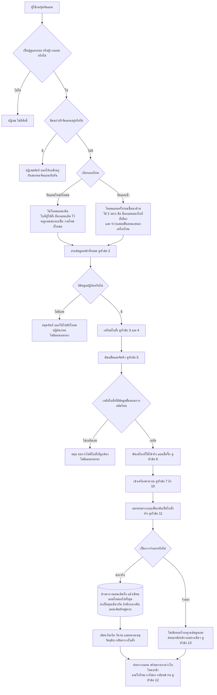

**ปุ่ม 2 แบบต่างกันตรงไหน**

| ประเด็น | จัดแผนใหม่ทั้งหมด | จัดแผนซ้ำ |
|---|---|---|
| ใบที่ผู้ใช้ตั้งไว้ว่า "ล็อกแผนเดิม" | ถูกลดสถานะเป็นงานใหม่ แผนเดิมไม่ถูกเคารพ | แผนเดิมถูกคัดลอกมาใช้ทั้งดุ้น ไม่คำนวณใหม่ |
| ความจำว่าขั้นตอนไหนเคยลงเครื่องไหน | ไม่มี ทุกขั้นตอนเปิดให้เครื่องแข่งกันใหม่ | มี ใช้ล็อกเครื่องของงานที่ผลิตไปแล้ว |
| ป้าย "ไม่มีข้อมูลขั้นตอนการผลิต" บนหน้าใบสั่ง | ล้างและประทับใหม่เฉพาะใบที่เพิ่งนำเข้า | ล้างและประทับใหม่ทุกใบที่ยังไม่ถูกลบ และไล่ประทับถึง **ลอทลูก** ที่อยู่ในถุงแพ็คด้วย |
| ตราเวลา "แผนถูกแก้ล่าสุด" | ไม่ประทับ | ประทับก่อนเริ่มคำนวณ |

**ผลที่ตามมา:** ถ้าอยากให้แผนนิ่ง ไม่กระโดดไปมาทุกครั้งที่จัด ต้องใช้ "จัดแผนซ้ำ"
ส่วน "จัดแผนใหม่ทั้งหมด" ใช้เมื่อต้องการรื้อกระดานใหม่หมด

**ทางออกมี 3 ทาง** — สองทางแรกจบก่อนถึงเครื่องคำนวณ และ **ไม่มีแถวแผนออกมาเลย**

| ทางออก | เกิดเมื่อไหร่ | หน้าจอเห็นอะไร |
|---|---|---|
| ไม่มีปฏิทิน | ตารางปฏิทินกำลังการผลิตว่างเปล่า | ข้อความเตือนให้ไปอัปโหลดปฏิทิน แผนเป็นศูนย์แถว |
| ไม่มีใบสั่งที่จัดได้ | ทุกใบหารุ่นในตารางขั้นตอนการผลิตไม่เจอ | ข้อความว่าไม่มีใบสั่งที่ถูกต้อง แผนเป็นศูนย์แถว |
| สำเร็จ | นอกจากนั้น | ตารางแผน + รายงานกำหนดส่ง + รายการที่วางไม่ลง + คำเตือนจิ๊กและปฏิทิน |

> ⚠️ **สองทางออกแรกคืนข้อมูลไม่ครบชุด** — ไม่มีรายการที่วางไม่ลง ไม่มีคำเตือนจิ๊ก ไม่มีคำเตือนปฏิทิน
> หน้าจอที่อ่านค่าเหล่านี้ต้องเผื่อกรณี "ไม่มีคีย์นั้นเลย" ไว้เสมอ ไม่ใช่แค่ "เป็นค่าว่าง"

> **ใครกดได้บ้าง:** จัดแผนและจัดแผนซ้ำ เปิดให้เฉพาะ **ผู้ดูแลระบบ (ADMIN)** และ **ผู้วางแผน (PLANNER)**
> ส่วนการเปิดดูแผนล่าสุด ฝ่ายผลิต (MFG) ดูได้ด้วย

> **กันกดซ้อน:** ระบบมีล็อกตัวเดียวทั้งโปรเซส คนที่สองที่กดระหว่างที่ยังคำนวณไม่เสร็จ
> จะถูกปฏิเสธพร้อมข้อความให้รอ **ไม่ใช่เข้าคิว** — ล็อกนี้อยู่ในหน่วยความจำ รีสตาร์ทเซิร์ฟเวอร์แล้วหาย
> และ **การเปิดดูแผนล่าสุดไม่ติดล็อกนี้** ดูได้ตลอดแม้ระหว่างกำลังจัดแผน

---

## 2. ข้อมูลเข้า ระบบอ่านอะไรบ้าง

ก่อนคำนวณอะไร ระบบจะดึงตารางข้อมูลหลักทั้งหมดมาแปลงเป็นตารางค้นหาในหน่วยความจำก่อน

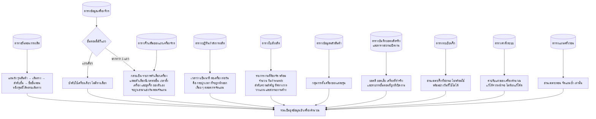

**สรุปว่าอะไรมาจากไหน**

| ต้นทาง | กลายเป็นอะไร | มีผลต่อ |
|---|---|---|
| ตารางขั้นตอนการผลิต | ลำดับขั้นตอนของแต่ละรุ่น แยกตามเส้นทาง | โครงที่ทุกอย่างเดินตาม หารุ่นไม่เจอ = ใบนั้นถูกคัดออก (หัวข้อ 3) |
| ตารางข้อมูลเครื่องจักร + จิ๊กเสริม | ตัวเลือกเครื่อง เวลาต่อชิ้น เวลาตั้งเครื่อง ชุดจิ๊ก | กำหนดว่าขั้นตอนนี้แข่งกันกี่เครื่อง และกินเวลาเท่าไหร่ |
| ตารางปฏิทินกำลังการผลิต | เวลาว่างรายเครื่องรายวัน | ทรัพยากรจำกัดที่ทุกใบสั่งแย่งกัน ใครมาก่อนได้ก่อน |
| ตารางใบสั่งผลิต | รายการงาน | ตัวตั้งของทุกการคำนวณ (ใบที่ปิดงานแล้วถูกกรองออกตั้งแต่ตอนอ่าน) |
| ตารางข้อมูลหลักสินค้า | กลุ่มการตั้งเครื่อง | กุญแจมัดแพ็คในหัวข้อ 5 |
| บันทึกยอดผลิตจริง + สถานะปิดงาน | ยอดที่ทำแล้ว เครื่องที่ทำ งานที่ปิดแล้ว | ป้อนเข้าสูตรหัวข้อ 4 และใช้ล็อกเครื่องในหัวข้อ 8 กับ 10 |
| ทะเบียนจิ๊ก | ช่วงวันที่จิ๊กใช้ไม่ได้ | ตัดกำลังผลิตของวันนั้นเป็นศูนย์ (หัวข้อ 6 และ 10) |
| ตารางค่าตั้งระบบ | ค่าปรับแต่งเครื่องคำนวณ | ดู [ตารางค่าคงที่](#ตารางค่าคงที่ทั้งหมด) |
| ตารางแผนครั้งก่อน | แผนที่ล็อกไว้ + ความจำเรื่องเครื่อง | เฉพาะตอนจัดแผนซ้ำ (หัวข้อ 7) |

> **จุดที่มักงงกัน:** ขั้นตอนที่มีเครื่องให้เลือกหลายตัว กับขั้นตอนที่บังคับเครื่องเดียว
> ต่างกันแค่ "จำนวนแถวในตารางข้อมูลเครื่องจักรของขั้นตอนนั้น" เท่านั้น
> ถ้าอยากให้ขั้นตอนหนึ่งกระจายไปหลายเครื่องได้ ต้องเพิ่มแถวเข้าไป

### ตารางที่สร้างด้วยมือ ถ้าเครื่องนั้นยังไม่มีจะเป็นยังไง

ระบบนี้ไม่มีตัวรันสคริปต์สร้างตารางอัตโนมัติ — ตารางและคอลัมน์กลุ่มหนึ่งถูกเพิ่มด้วยมือ
ระบบจึงตรวจก่อนอ่านทุกครั้ง และ **ถ้าไม่มี ต้องทำงานต่อได้เหมือนไม่มีฟีเจอร์นั้น**

| ของที่สร้างด้วยมือ | ถ้าไม่มี |
|---|---|
| คอลัมน์ "เปิด/ปิดเครื่อง" ในตารางเครื่องจักร | ถือว่าทุกเครื่องเปิดใช้งานหมด |
| ตารางจิ๊กเสริมของแถวเครื่องจักร | หนึ่งแถวใช้จิ๊กได้ตัวเดียวเหมือนเดิม |
| ตารางทะเบียนจิ๊ก | ระบบมองไม่เห็นจิ๊กพัง ไม่ตัดกำลังผลิต และไม่มีคำเตือนเรื่องจิ๊ก |
| คอลัมน์ "วัตถุดิบเข้าแล้ว" ในตารางใบสั่ง | หมายเหตุวัตถุดิบกลับไปคำนวณอัตโนมัติอย่างเดียว (หัวข้อ 3) |
| **ตารางค่าตั้งระบบ** | ⚠️ **จัดแผนไม่ได้เลย ระบบตอบข้อผิดพลาด** — ดู [ข้อสังเกต](#ข้อสังเกตสำหรับผู้ดูแลระบบ) หัวข้อ “ตารางค่าตั้งระบบไม่มีตัวป้องกันแบบตารางอื่น” |

> **"วันนี้" ที่ใช้ตั้งวันปล่อยงาน คือวันตามปฏิทินธรรมดา** ไม่ใช่ "วันของโรงงาน" ที่ตัดรอบ 07:00
> ในหัวข้อ 7 — สองที่นี้ใช้นิยามวันคนละแบบ **โดยตั้งใจ**

---

## 3. เตรียมใบสั่งก่อนเข้าเครื่องคำนวณ

ก่อนมัดแพ็ค ระบบแปลงแถวใบสั่งดิบให้เป็นงานที่เครื่องคำนวณเข้าใจ และตัดใบที่จัดไม่ได้ออก

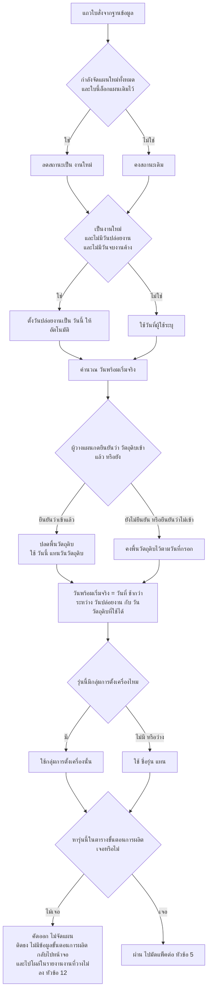

**กติกาที่ต้องรู้**

| กติกา | รายละเอียด |
|---|---|
| **วันพร้อมเริ่มจริง = วันที่ช้ากว่า ระหว่างวันปล่อยงานกับวันวัตถุดิบ** | ไม่ใช่วันปล่อยงานอย่างเดียว งานจะไม่ถูกวางก่อนวัตถุดิบเข้า |
| **ปุ่ม "วัตถุดิบเข้าแล้ว" ไม่ใช่ป้ายแสดงผลเฉย ๆ** | มันเป็น**ข้อมูลเข้าของเครื่องคำนวณ** กดแล้วพื้นวัตถุดิบถูกปลด งานเริ่มได้เร็วขึ้นจริง |
| **ค่าที่ยังไม่เคยกด กับกดว่า "ไม่เข้า" ให้ผลเหมือนกันต่อการวางแผน** | ต่างกันแค่ข้อความหมายเหตุที่เขียนกลับ (หัวข้อ 11) |
| **วันที่กรอกเป็นคำว่า none / null / wait ถือว่าไม่ได้กรอก** | ระบบล้างให้เป็นค่าว่างก่อนใช้งานทุกครั้ง |
| **กลุ่มการตั้งเครื่องที่ว่าง ถอยไปใช้ชื่อรุ่น** | ผลคือรุ่นนั้นมัดแพ็คได้กับตัวเองเท่านั้น |
| **ใบที่ไม่มีข้อมูลขั้นตอนการผลิต ไม่เคยเข้าเครื่องคำนวณ** | จึงไม่มี "ขั้นตอนที่ตัน" ให้ชี้ ต้องรายงานแยกต่างหาก (หัวข้อ 12) |

> ⚠️ **การกดปุ่ม "วัตถุดิบเข้าแล้ว" ใบเดียว อาจขยับวันของใบอื่นด้วย**
> เพราะวันพร้อมเริ่มจริงเป็น**ส่วนหนึ่งของกุญแจมัดแพ็ค** (หัวข้อ 5) พอเปลี่ยน ใบนั้นอาจย้ายถุง
> ทำให้เพื่อนร่วมถุงเดิมถูกจัดใหม่ไปด้วย — เป็นพฤติกรรมที่ตั้งใจ ไม่ใช่ความผิดพลาด

---

## 4. ยอดผู้รอดชีวิต และยอดเสมือน

**นี่คือส่วนที่เข้าใจยากที่สุดของทั้งระบบ** และเป็นคำตอบของคำถามว่า
*"ทำไมพอต้นน้ำมีของเสีย แผนของขั้นตอนปลายน้ำถึงลดจำนวนลงตามเองได้"*

### ปัญหาที่ต้องแก้

เครื่องคำนวณรู้จักแค่ 2 ตัวเลขต่อขั้นตอน คือ **"สั่งเท่าไหร่"** กับ **"ทำไปแล้วเท่าไหร่"**
มันไม่มีแนวคิดเรื่อง "ของเสียที่ขั้นตอนก่อนหน้า" เลย

ดังนั้นแทนที่จะไปแก้เครื่องคำนวณ ระบบเลือกวิธี **ป้อนตัวเลข "ทำไปแล้ว" แบบเสมือนให้มันแทน** —
ผลคือเครื่องคำนวณจะจัดคิวขั้นตอนปลายน้ำน้อยลงเองโดยอัตโนมัติ เหมือนน้ำไหลลดหลั่นลงตามน้ำตก

### สูตร 3 ชั้น

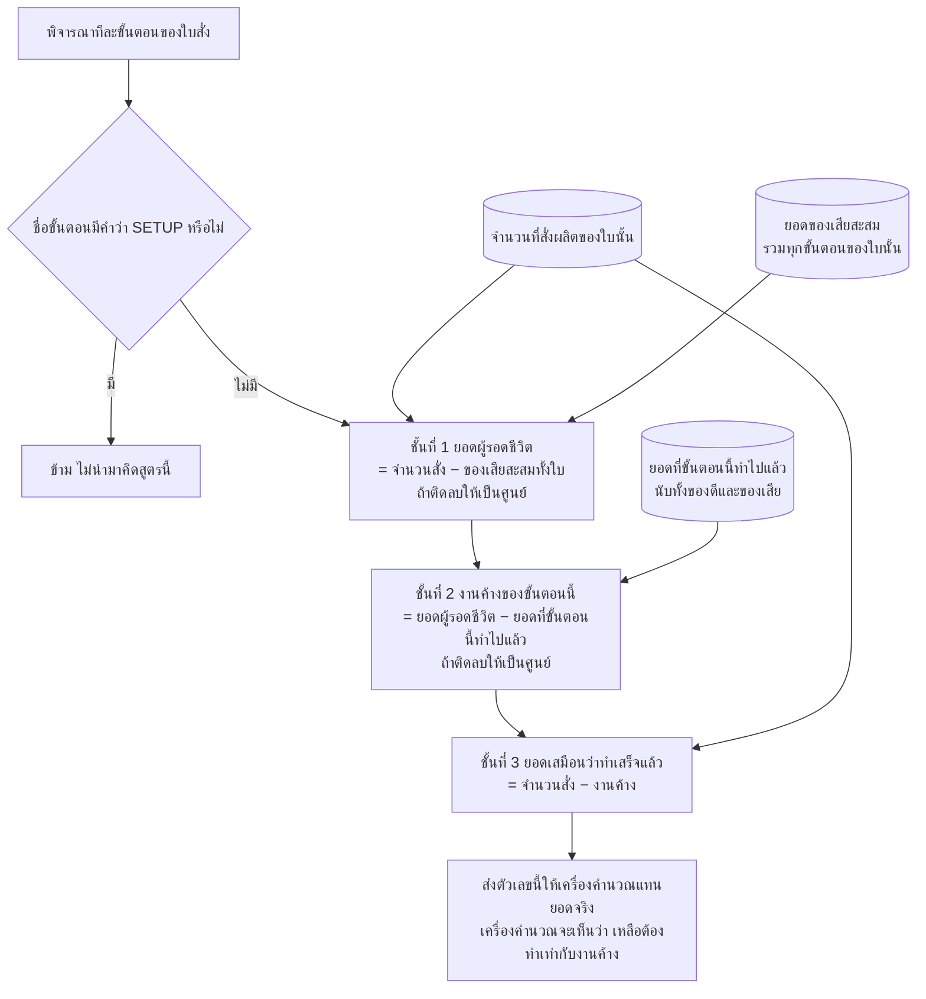

### ตัวอย่างที่เกิดขึ้นจริง

ใบสั่งหนึ่ง สั่งผลิต **20 ชิ้น** มี 2 ขั้นตอน ขั้นตอนที่ 1 ทำไปแล้ว **ได้ดี 17 เสีย 3**
ขั้นตอนที่ 2 ยังไม่ได้เริ่มเลย

| | ขั้นตอนที่ 1 | ขั้นตอนที่ 2 |
|---|---|---|
| ยอดของเสียสะสมทั้งใบ | 3 | 3 |
| **ยอดผู้รอดชีวิต** = 20 − 3 | **17** | **17** |
| ยอดที่ขั้นตอนนี้ทำแล้ว ดี+เสีย | 17 + 3 = 20 | 0 |
| **งานค้าง** = ผู้รอดชีวิต − ทำแล้ว | 17 − 20 → ติดลบ → **0** | 17 − 0 = **17** |
| **ยอดเสมือน** = 20 − งานค้าง | 20 − 0 = **20** | 20 − 17 = **3** |
| เครื่องคำนวณเห็นว่าเหลือต้องทำ | 20 − 20 = **0 ชิ้น** ✔ ปิดงาน | 20 − 3 = **17 ชิ้น** ✔ |

**อ่านผลลัพธ์:** ขั้นตอนที่ 1 ถูกมองว่าจบแล้ว ไม่ถูกจัดคิวอีก ส่วนขั้นตอนที่ 2 ถูกจัดคิวแค่ **17 ชิ้น**
ไม่ใช่ 20 — ของเสีย 3 ชิ้นที่หายไปตั้งแต่ต้นน้ำ ถูกหักออกจากภาระงานปลายน้ำโดยอัตโนมัติ

### ข้อควรรู้

- **ของเสียถูกนับรวมทั้งใบ ไม่ได้แยกรายขั้นตอน** — เสียที่ขั้นตอนไหนก็ตาม ทำให้ยอดที่ไหลต่อไป
  ลดลงทั้งสายเท่ากันหมด
- **ขั้นตอนที่มีคำว่า SETUP ในชื่อจะถูกข้าม** ไม่นำมาคิดสูตรนี้ เพราะไม่ใช่งานที่มีจำนวนชิ้น
- **ลำดับที่ไล่ขั้นตอนในสูตรนี้ ใช้ "หมายเลขเส้นทาง" ไม่ใช่ "ลำดับขั้น"** — ผลลัพธ์ของสูตร
  ไม่ขึ้นกับลำดับอยู่แล้ว จึงคงไว้ตามนี้ ดู [ข้อสังเกต](#ข้อสังเกตสำหรับผู้ดูแลระบบ) หัวข้อ “สูตรยอดเสมือน ไล่ขั้นตอนตาม”
- ตัวเลข "ยอดเสมือน" ถูกใช้ต่อในหัวข้อ 10 เป็นเงื่อนไข "เคยผลิตแล้วหรือยัง"
  และในหัวข้อ 11 เพื่อคำนวณว่าลอทลูกแต่ละใบยังค้างอยู่เท่าไหร่

---

## 5. มัดแพ็คใบสั่ง และจัดคิว

ถ้าใบสั่งหลายใบตั้งเครื่องเหมือนกัน การจัดแยกกันจะเสียเวลาตั้งเครื่องหลายรอบ ระบบจึงมัดรวมเป็นก้อนเดียว

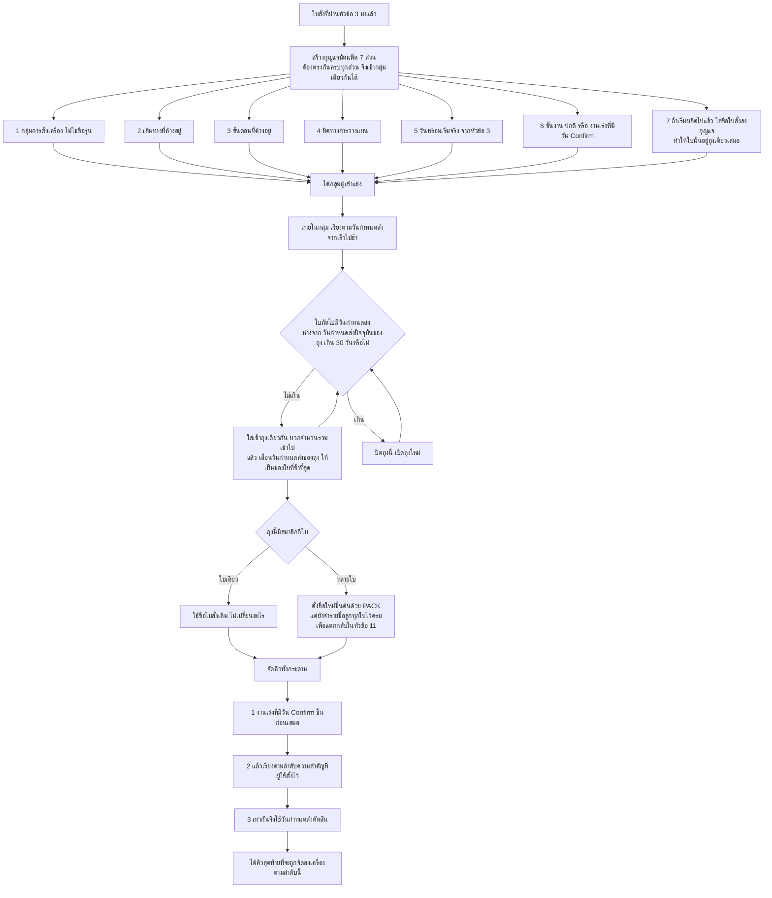

**ประเด็นสำคัญ**

| ประเด็น | รายละเอียด |
|---|---|
| **กุญแจคือกลุ่มการตั้งเครื่อง ไม่ใช่ชื่อรุ่น** | ต่างรุ่นกันแต่ตั้งกลุ่มการตั้งเครื่องตรงกัน ก็ถูกมัดรวมได้ ถ้าเห็นถุงหนึ่งมีหลายรุ่นปนกัน นั่นคือพฤติกรรมที่ตั้งใจ |
| ⚠️ **ระยะ 30 วัน วัดจาก "วันกำหนดส่งปัจจุบันของถุง" ซึ่งเลื่อนตามใบที่ช้าที่สุด** | ไม่ใช่วัดจากใบแรกของถุง — ผลคือถุงเดียวกินช่วงเกิน 30 วันได้แบบลูกโซ่ (เช่น ใบห่างกันใบละ 25 วัน 4 ใบ = ถุงเดียวกินช่วง 75 วัน) **นี่เป็นจุดที่คนอ่านผิดบ่อยที่สุด** |
| **วันพร้อมเริ่มจริงเป็นส่วนหนึ่งของกุญแจ** | วันวัตถุดิบต่างกัน = คนละถุง และการกดปุ่มวัตถุดิบเข้าจึงย้ายถุงได้ (หัวข้อ 3) |
| **ใบที่เริ่มผลิตไปแล้ว ถูกบังคับให้อยู่ถุงเดี่ยว** | เพราะมันมีเครื่องและเส้นทางที่ถูกล็อกไว้ในชีวิตจริงแล้ว จะเอาไปมัดกับใบใหม่ไม่ได้ |
| **งานที่มีวัน Confirm คือ "งานเร่ง"** | วัน Confirm **สวมรอยเป็นวันกำหนดส่ง** และงานเร่งจะขึ้นคิวก่อนงานปกติทุกใบ แม้ลำดับความสำคัญจะแย่กว่า |
| **ถุงที่มีใบเดียวไม่เปลี่ยนชื่อ** | จะเห็นชื่อ PACK เฉพาะกรณีที่มัดได้จริงตั้งแต่ 2 ใบขึ้นไป |

---

## 6. เครื่องที่ใช้ได้จริง และเรื่องจิ๊ก

ก่อนส่งเข้าเครื่องคำนวณ ระบบต้องตอบให้ได้ก่อนว่า **ขั้นตอนนี้เหลือเครื่องให้เลือกจริง ๆ กี่ตัว**

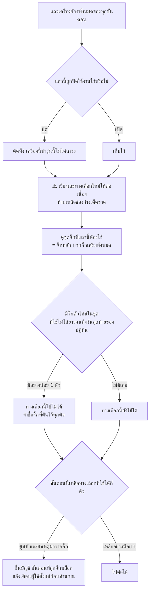

### ก. ปิดเครื่องไม่ให้ทำรุ่นนี้

แถวเครื่องจักรที่ถูกตั้งเป็น "ปิดใช้งาน" แปลว่า **เครื่องนี้ทำรุ่นนี้ไม่ได้ถาวร** ไม่ใช่แค่วันนี้
ระบบตัดทิ้งก่อนเข้าเครื่องคำนวณ

> ⚠️ **หลังตัดแล้วต้องเรียงเลขทางเลือกใหม่ให้ต่อเนื่อง — นี่คือเหตุผลทั้งหมดที่ขั้นตอนนี้มีอยู่**
> เครื่องคำนวณจับคู่ "เครื่องตัวที่ N" กับ "เวลาต่อชิ้นตัวที่ N" และ "เวลาตั้งเครื่องตัวที่ N"
> **ด้วยตำแหน่งล้วน ๆ** ถ้าปิดทางเลือกตรงกลางแล้วปล่อยให้เหลือช่องว่าง
> เครื่องตัวหนึ่งจะถูกจับคู่กับ**เวลาต่อชิ้นของเครื่องอีกตัว** แผนจะเพี้ยนแบบเงียบ ๆ ไม่มีข้อความผิดพลาด
> (การเรียงใหม่เรียงตามเลขทางเลือกเดิม ไม่ใช่ตามลำดับแถวในตาราง — สองอย่างนี้ไม่เหมือนกัน
> เพราะหน้าจอให้พิมพ์เลขทางเลือกเองได้)

### ข. จิ๊กพังเป็นช่วงวัน

ทะเบียนจิ๊กเก็บช่วงวันที่จิ๊กแต่ละตัวใช้ไม่ได้ ระบบแปลงเป็นตารางค้นหา แล้วใช้ 2 ที่:

1. **ตรวจล่วงหน้าก่อนคำนวณ** (หัวข้อนี้) — เพื่อบอกผู้ใช้ว่าสาเหตุคือจิ๊ก ไม่ใช่เครื่องไม่พอ
2. **ระหว่างจัดแผนสายเดินหน้า** (หัวข้อ 10) — วันที่จิ๊กใช้ไม่ได้ ถือว่ากำลังผลิตของวันนั้นเป็นศูนย์

**กติกาของชุดจิ๊ก — หนึ่งแถวเครื่องจักรใช้จิ๊กพร้อมกันได้หลายตัว และความหมายคือ "และ"**

| เรื่อง | กติกา | ทำไม |
|---|---|---|
| **การบล็อก** | จิ๊กตัวใดตัวหนึ่งในชุดใช้ไม่ได้ = ทั้งแถวใช้ไม่ได้ | ขาดตัวเดียวก็ตั้งเครื่องไม่ได้ |
| **ส่วนลดเวลาตั้งเครื่อง** | ชุดจิ๊กต้อง**เท่ากันเป๊ะทั้งชุด** ไม่ใช่แค่มีตัวร่วมกัน | งานที่ใช้ `{จิ๊ก1}` ต่อจากงานที่ใช้ `{จิ๊ก1, จิ๊ก2}` ยังต้องถอดจิ๊ก2 ออก จึงต้องจ่ายค่าตั้งเครื่องเต็ม |
| **ค่า `-` แปลว่าไม่ใช้จิ๊ก** | ถูกตัดออกจากชุดก่อนคำนวณทุกครั้ง | ถ้าไม่ตัด จิ๊กชื่อ `-` ที่ถูกมาร์คว่าพังจะบล็อกทุกขั้นตอนที่ไม่ใช้จิ๊กทั้งระบบ |

**เกณฑ์ "ใช้ไม่ได้ยาวจนถึงวันสุดท้ายของปฏิทิน"** — ไม่ใช่แค่ "พังไม่มีกำหนด"
จิ๊กที่จะกลับมาใช้ได้**หลังวันสุดท้ายของปฏิทิน** ก็นับว่าตันเหมือนกัน เพราะเครื่องคำนวณ
เดินได้แค่ในช่วงที่ปฏิทินมีข้อมูล — และผู้ใช้ต้องแก้คนละวิธี (รอซ่อม กับ สร้างปฏิทินเพิ่มแล้วจัดแผนซ้ำ)
ข้อความเตือนจึงบอกทั้งชื่อจิ๊กที่ตัน และวันสุดท้ายของปฏิทิน

> ⚠️ **การบล็อกด้วยจิ๊กทำงานเฉพาะสายเดินหน้าเท่านั้น** สายถอยหลัง (หัวข้อ 8) ไม่ตรวจจิ๊กระหว่างไล่ปฏิทิน
> ดู [ข้อสังเกต](#ข้อสังเกตสำหรับผู้ดูแลระบบ) หัวข้อ “สายถอยหลังไม่ตรวจจิ๊กพัง”

---

## 7. เตรียมปฏิทิน และแยกใบสั่งเป็น 3 สาย

### ก. ปรับปฏิทินก่อนเริ่มจัด

นี่คือคำตอบของคำถามที่เจอบ่อยที่สุด — *"ทำไมวันนี้ระบบถึงจัดงานลงได้น้อยกว่าที่ตั้งไว้ในปฏิทิน"*

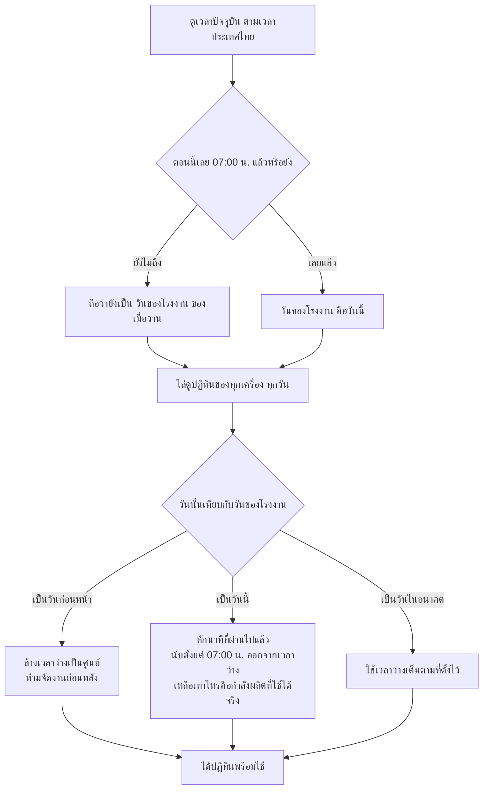

**ตัวอย่าง:** ถ้าเครื่องหนึ่งตั้งเวลาว่างวันนี้ไว้ 480 นาที แต่ตอนนี้เป็นเวลา 13:00 น.
เวลาที่ผ่านไปแล้วนับจาก 07:00 น. คือ 360 นาที → เวลาว่างที่ใช้จัดแผนได้เหลือ **120 นาที**

> **เวลาที่ใช้เป็นเวลาประเทศไทยเสมอ** ไม่ว่าเครื่องแม่ข่ายจะตั้งเขตเวลาไว้แบบไหน

### ข. แยกใบสั่งเข้า 3 สาย

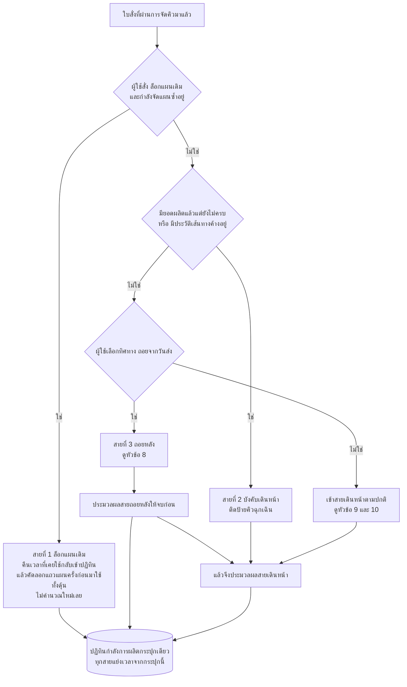

**เหตุผลของแต่ละสาย**

| สาย | เข้าเมื่อไหร่ | ทำอะไร | ทำไม |
|---|---|---|---|
| ล็อกแผนเดิม | ผู้ใช้ตั้งไว้ + กำลังจัดแผนซ้ำ | คืนเวลาเข้าปฏิทิน แล้วคัดลอกแผนเดิม | ผู้ใช้ยืนยันแผนนี้กับลูกค้าไปแล้ว ห้ามเปลี่ยน |
| บังคับเดินหน้า | เริ่มผลิตไปแล้วบางส่วน หรือมีงานค้างในสาย | เดินหน้าเสมอ ห้ามคำนวณถอยหลัง | งานที่ลงมือไปแล้วย้อนเวลากลับไปเริ่มใหม่ไม่ได้ |
| ถอยหลัง | ผู้ใช้เลือกทิศทางถอยจากวันส่ง | คำนวณย้อนจากวันกำหนดส่ง | ต้องการชนวันส่งพอดี ไม่ผลิตดักหน้าเป็นสต็อก |
| เดินหน้า | นอกจากนั้นทั้งหมด | คำนวณจากวันพร้อมเริ่มจริงไปข้างหน้า | ต้องการเสร็จเร็วที่สุดเท่าที่กำลังผลิตเอื้อ |

> **ป้ายคิวฉุกเฉินของสายบังคับเดินหน้าไม่ได้จัดคิวใหม่** — คิวถูกเรียงจบไปแล้วตั้งแต่หัวข้อ 5
> ป้ายนี้ติดไว้เพื่อให้ตอนเรียงแถวลงฐานข้อมูลรู้ว่าเป็นงานค้างเท่านั้น

> ⚠️ **สายถอยหลังถูกประมวลผลก่อนสายเดินหน้าเสมอ** และทั้งสองสายหักเวลาจากปฏิทินกระปุกเดียวกัน
> ผลคือ **ใบที่มาก่อนได้เลือกก่อน** การสลับลำดับความสำคัญของใบสั่งเพียงใบเดียว
> อาจทำให้แผนเปลี่ยนทั้งกระดาน

---

## 8. สายถอยหลัง ไล่จากวันกำหนดส่งย้อนขึ้นต้นน้ำ

เป้าหมายคือ **"เริ่มงานให้ช้าที่สุดเท่าที่ยังทันวันส่ง"** เพื่อไม่ให้ของค้างสต็อก

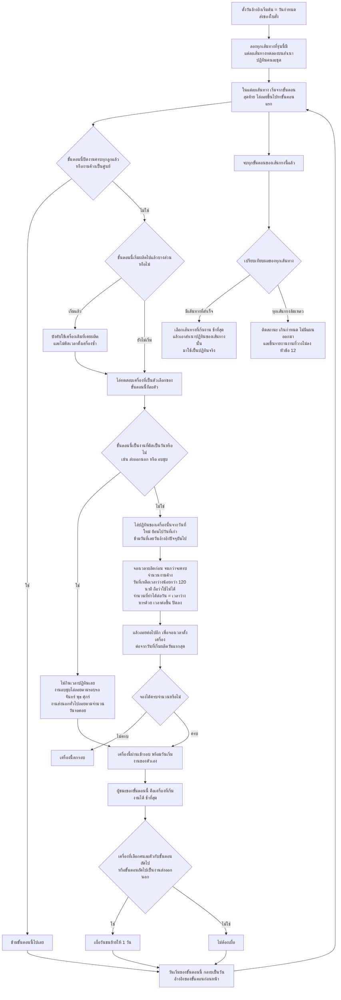

**ตรรกะ "ช้าที่สุดชนะ" อธิบายยังไง**

ในสายถอยหลัง เป้าหมายไม่ใช่เสร็จเร็ว แต่คือ **เสร็จพอดีวันส่ง** ถ้ามีเครื่องให้เลือก 2 ตัว
ตัวหนึ่งเริ่มได้วันที่ 1 อีกตัวเริ่มได้วันที่ 10 และทั้งคู่ทันวันส่งเหมือนกัน
ระบบเลือกตัวที่เริ่มวันที่ 10 เพราะ **ปล่อยกำลังผลิตช่วงต้นไว้ให้งานอื่นที่เร่งกว่า**
และวัตถุดิบไม่ต้องออกจากคลังเร็วเกินจำเป็น

**ผลที่ตามมา**

- สำเนาปฏิทินของเส้นทางที่ชนะ **ถูกยกมาแทนปฏิทินจริงทั้งชุด** ดังนั้นเวลาที่เส้นทางที่แพ้จองไว้
  จะถูกคืนกลับไปโดยอัตโนมัติ
- ใบที่ติดสถานะ "เกินกำหนด" จะไม่มีแถวแผนเลย ต้องแก้ด้วยการขยับวันส่ง เพิ่มกำลังผลิตในปฏิทิน
  หรือลดจำนวน
- งานส่งออกนอกและงานอบชุบในสายนี้ ถูกไล่ย้อนตามรอบรถ **จันทร์ / พุธ / ศุกร์** เช่นเดียวกับสายเดินหน้า
- ⚠️ **สายนี้ไม่ตรวจจิ๊กพัง** งานที่วางถอยหลังจึงอาจถูกวางลงวันที่จิ๊กใช้ไม่ได้
  ดู [ข้อสังเกต](#ข้อสังเกตสำหรับผู้ดูแลระบบ) หัวข้อ “สายถอยหลังไม่ตรวจจิ๊กพัง”

---

## 9. สายเดินหน้า ตอนเลือกเส้นทางผลิต

ระบบ **ไม่ได้** ยอมให้ทุกใบเลือกเส้นทางใหม่ เงื่อนไขเข้มมาก

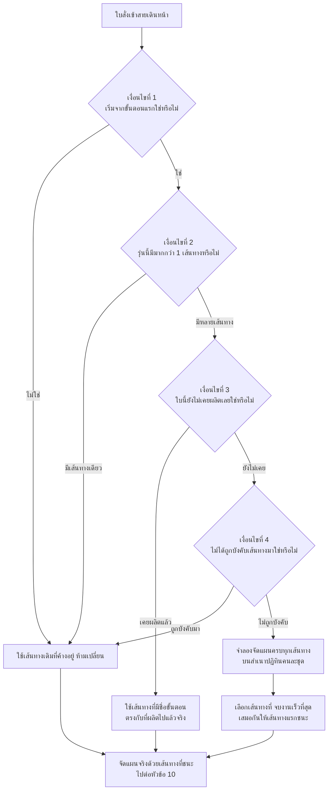

**เหตุผลของแต่ละเงื่อนไข**

| เงื่อนไข | ทำไมต้องมี |
|---|---|
| เริ่มจากขั้นตอนแรก | ถ้างานเดินไปกลางทางแล้ว การเปลี่ยนเส้นทางแปลว่าของที่ทำไปแล้วใช้ไม่ได้ |
| มีมากกว่า 1 เส้นทาง | ไม่มีอะไรให้เลือก ก็ไม่ต้องเสียเวลาจำลอง |
| ยังไม่เคยผลิตเลย | ถ้ามียอดผลิตแล้วแม้ชิ้นเดียว แปลว่าเส้นทางถูกเลือกไปแล้วในชีวิตจริง — ระบบจะไปหาเส้นทางที่มีชื่อขั้นตอนตรงกับที่ผลิตจริงแทน |
| ไม่ได้ถูกบังคับเส้นทาง | ผู้ใช้ระบุเส้นทางมาเอง ระบบต้องเคารพ |

> **ต่างจากสายถอยหลัง:** สายถอยหลังเลือกเส้นทางที่ **เริ่มช้าที่สุด**
> ส่วนสายเดินหน้าเลือกเส้นทางที่ **จบเร็วที่สุด** — เพราะเป้าหมายคนละอย่างกัน

> ถ้าจำลองแล้วไม่มีเส้นทางไหนสำเร็จเลย ระบบจะถอยไปใช้ **เส้นทางแรกของรุ่นนั้น**

> ⚠️ **ตอนจำลองหาเส้นทาง ไม่คิดส่วนลดเวลาตั้งเครื่อง** — คิดเวลาตั้งเครื่องเต็มเสมอ
> ส่วนลดจะถูกคิดตอนจัดแผนจริงเท่านั้น เพราะตอนจำลองยังไม่รู้ว่าจิ๊กชุดล่าสุดบนเครื่องจะเป็นชุดไหน
> ผลคือ **เส้นทางที่ชนะการจำลอง อาจไม่ใช่เส้นทางที่ดีที่สุดจริงหลังคิดส่วนลดแล้ว**

---

## 10. สายเดินหน้า ตอนไล่ทีละขั้นตอน

นี่คือส่วนที่ตอบคำถาม *"ทำไมระบบถึงเอางานนี้ไปลงเครื่องนี้ ในวันนี้"*

```mermaid
flowchart TD
    ST["วันเริ่มต้นของใบสั่ง<br/>= วันที่ ช้ากว่า ระหว่าง วันแรกที่ปฏิทินเปิด<br/>กับ วันพร้อมเริ่มจริง จากหัวข้อ 3"] --> LOOP["ไล่ทีละขั้นตอน จากต้นไปปลาย"]

    LOOP --> GAP{"เทียบกับขั้นตอนก่อนหน้า"}
    GAP -->|"เปลี่ยนเครื่อง หรือขั้นตอนก่อนเป็นงานส่งออกนอก"| GAP1["เริ่มขั้นตอนนี้ที่ วันจบของขั้นตอนก่อน บวก 1 วัน"]
    GAP -->|"เครื่องเดิม"| GAP2["เริ่มขั้นตอนนี้ที่ วันจบของขั้นตอนก่อน"]

    GAP1 --> MLOCK{"กฎล็อกเครื่อง<br/>ขั้นตอนนี้ผลิตไปแล้วบางส่วนหรือไม่"}
    GAP2 --> MLOCK
    MLOCK -->|"ผลิตแล้ว"| ML1["บังคับใช้เครื่องเดิมที่เคยผลิต ห้ามย้าย<br/>หาจากบันทึกยอดผลิตจริงก่อน<br/>ถ้าไม่เจอจึงหาจากแผนครั้งก่อน"]
    MLOCK -->|"ยังไม่เคยผลิต"| ML2["เปิดให้ทุกเครื่องที่เป็นตัวเลือกแข่งกัน"]

    ML1 --> SU
    ML2 --> SU
    SU{"กฎล้างเวลาตั้งเครื่อง<br/>งานคาเครื่องอยู่ หรือ เคยผลิตแล้ว<br/>หรือ เป็นขั้นตอนเริ่มของงานค้างที่นำเข้ามา"}
    SU -->|"เข้าเงื่อนไขข้อใดข้อหนึ่ง"| SU1["ไม่คิดเวลาตั้งเครื่องเลย<br/>เพราะตั้งไปแล้วในชีวิตจริง"]
    SU -->|"ไม่เข้าเลย"| SU2{"งานล่าสุดบนเครื่องนั้น<br/>ใช้ชุดจิ๊ก เดียวกันเป๊ะ หรือไม่"}
    SU2 -->|"ชุดเดียวกันเป๊ะ"| SU3["คิดเวลาตั้งเครื่องแบบประหยัด<br/>เพียง 40 นาที หรือค่าจริงถ้าน้อยกว่า"]
    SU2 -->|"คนละชุด"| SU4["คิดเวลาตั้งเครื่องเต็มตามตารางเครื่องจักร"]

    SU1 --> TYPE
    SU3 --> TYPE
    SU4 --> TYPE
    TYPE{"ขั้นตอนนี้เป็นงานที่คิดเป็นวันหรือไม่<br/>เช่น ส่งออกนอก หรือ อบชุบ"}

    TYPE -->|"ใช่"| DAY["ไม่กินเวลาปฏิทินเลย<br/>ใช้ช่องเวลาต่อชิ้นเป็น จำนวนวันรอคอย แทน<br/>งานอบชุบต้องส่งและรับตรงรอบรถ จันทร์ พุธ ศุกร์ เท่านั้น"]
    TYPE -->|"ไม่ใช่"| MIN["ไล่จองปฏิทินไปข้างหน้าทีละวัน"]

    MIN --> JIGD{"วันนั้นมีจิ๊กในชุดตัวใดตัวหนึ่งใช้ไม่ได้หรือไม่"}
    JIGD -->|"ใช้ไม่ได้"| JIG1["ถือว่าวันนั้นกำลังผลิตเป็นศูนย์<br/>ใช้ทางเดียวกับวันหยุด"]
    JIGD -->|"ใช้ได้"| F{"วันนั้นมีเวลาว่างถึง 120 นาทีหรือไม่"}
    F -->|"ไม่ถึง"| F1["ถือว่าวันนั้นใช้ไม่ได้ ข้ามไป<br/>กันเศษเวลาที่ทำอะไรไม่ได้จริง"]
    F -->|"ถึง"| F2["ใส่เวลาตั้งเครื่องให้ครบก่อน<br/>เวลาที่เหลือ หารด้วย เวลาต่อชิ้น ปัดลง<br/>= จำนวนที่ผลิตได้ในวันนั้น"]
    JIG1 --> RE
    F1 --> RE
    F2 --> RE
    RE{"กฎตั้งเครื่องใหม่<br/>งานขาดช่วงเกิน 1 วัน<br/>และช่วงที่ขาดนั้นเครื่องมีเวลาว่าง"}
    RE -->|"ใช่ แปลว่ามีงานอื่นแทรก"| RE1["ต้องตั้งเครื่องใหม่ทั้งหมด<br/>คิดเวลาตั้งเครื่องเต็มอีกรอบ"]
    RE -->|"ไม่ใช่"| RE2["ทำต่อได้เลย"]

    RE1 --> DONE
    RE2 --> DONE
    DAY --> DONE
    DONE{"เครื่องนี้จองครบจำนวนหรือไม่"}
    DONE -->|"ไม่ครบ"| NOCAP["เครื่องนี้ตกรอบ"]
    DONE -->|"ครบ"| CAND["เข้ารอบ พร้อมวันจบงานของตัวเอง"]

    CAND --> WIN["ผู้ชนะเบื้องต้น = เครื่องที่ จบงานเร็วที่สุด"]
    WIN --> STICK{"กติกาติดเครื่องเดิม<br/>เครื่องที่ขั้นตอนก่อนหน้าใช้อยู่<br/>จบงานได้ ในวันเดียวกัน กับผู้ชนะหรือไม่"}
    STICK -->|"จบวันเดียวกัน"| STICK1["เปลี่ยนไปเลือกเครื่องเดิมแทน<br/>ประหยัดการขนย้ายและการตั้งเครื่อง"]
    STICK -->|"จบคนละวัน"| STICK2["ใช้ผู้ชนะเดิม"]

    STICK1 --> APPLY
    STICK2 --> APPLY
    APPLY["หักเวลาออกจากปฏิทินจริง<br/>จำชุดจิ๊กล่าสุดของเครื่องนั้นไว้<br/>บันทึกวันจบและเครื่องไว้ให้ขั้นตอนถัดไป"]
    APPLY --> LOOP

    NOCAP --> ALLFAIL{"ทุกเครื่องตกรอบหมดหรือไม่"}
    ALLFAIL -->|"ใช่"| ERR["ออกแถวสถานะ ไม่มีกำลังผลิต<br/>งานนี้ไม่มีแผน และขึ้นรายงานหัวข้อ 12"]
    ALLFAIL -->|"ไม่"| WIN
```

### กฎที่ต้องเข้าใจให้ลึก

**1. เวลาต่อชิ้นของงานส่งออกนอก ไม่ใช่นาทีต่อชิ้น**

สำหรับขั้นตอนกลุ่ม "คิดเป็นวัน" (ส่งออกนอก อบชุบ ฯลฯ) ช่องเดียวกันที่ปกติเก็บ "เวลาต่อชิ้นเป็นนาที"
จะถูกอ่านเป็น **"จำนวนวันรอคอย"** แทน ถ้าใส่เลข 3 หมายถึงรอ 3 วัน ไม่ใช่ 3 นาทีต่อชิ้น
**นี่เป็นจุดที่ป้อนข้อมูลผิดได้ง่ายที่สุด**

และเมื่อ**เปิดโหมดแผนละเอียดงานอบชุบ** (ค่าเริ่มต้นคือเปิด) งานอบชุบจะยึด**รอบรถเป็นหลัก
โดยไม่สนใจจำนวนวันรอคอยที่กรอกไว้เลย** — วันส่งและวันรับต้องตรงรอบ จันทร์/พุธ/ศุกร์ เท่านั้น

**2. กติกาติดเครื่องเดิม ทำงานเฉพาะกรณีจบวันเดียวกัน**

ระบบเปรียบเทียบเวลาจบงานในหน่วย **"วัน"** แต่ตั้งเกณฑ์ผ่อนผันไว้ในหน่วย "นาที" (60 นาที)
ผลจริงคือ กติกานี้จะเปลี่ยนผู้ชนะได้ **ก็ต่อเมื่อเครื่องเดิมกับผู้ชนะจบงานวันเดียวกันเป๊ะ** เท่านั้น
ถ้าเครื่องเดิมจบช้ากว่าแม้แต่ 1 วัน กติกานี้จะไม่ทำงาน — อ่านค่าคงที่ 60 นาทีว่า
"ยอมช้ากว่านี้เพื่ออยู่เครื่องเดิม" ไม่ได้ ดู [ข้อสังเกต](#ข้อสังเกตสำหรับผู้ดูแลระบบ) หัวข้อ “เกณฑ์ผ่อนผัน 60 นาที”

**3. วันที่มีเวลาว่างน้อยกว่า 120 นาที ถือว่าใช้ไม่ได้**

ไม่ใช่บั๊ก แต่เป็นการกันเศษเวลาที่ในความเป็นจริงทำอะไรไม่ได้ — ตั้งเครื่องยังไม่ทันเสร็จก็หมดกะแล้ว
ถ้าเห็นเครื่องว่าง 90 นาทีแล้วระบบไม่ยอมลงงาน นี่คือสาเหตุ

**4. กฎล้างเวลาตั้งเครื่อง สำคัญต่อความแม่นของแผน**

งานที่คาเครื่องอยู่จริงในโรงงาน ตั้งเครื่องไปแล้วในชีวิตจริง ถ้าระบบยังคิดเวลาตั้งเครื่องซ้ำ
แผนจะเลื่อนออกไปโดยไม่มีเหตุผล กฎนี้ตรวจ 3 ทาง คือ งานคาเครื่อง / มียอดผลิตแล้ว /
เป็นขั้นตอนเริ่มของงานค้างที่ผู้ใช้นำเข้ามา เข้าข้อใดข้อหนึ่งก็ล้างทิ้งทันที

**5. กฎตั้งเครื่องใหม่ ไม่สนใจว่าจิ๊กพังหรือไม่**

การตรวจว่า "มีงานอื่นมาแทรกหรือเปล่า" อ่าน**กำลังผลิตดิบของวันนั้น** ไม่ผ่านการบล็อกจิ๊ก
เพราะถ้าวันนั้นเครื่องมีเวลาว่างจริงและงานเราหยุดไป แปลว่าเครื่องไปทำอย่างอื่นมา — ต้องตั้งใหม่จริง
เป็นพฤติกรรมที่ตั้งใจ

---

## 11. หลังคำนวณ แตกยอด บันทึก และเขียนกลับ

แผนที่ได้จากหัวข้อ 8 ถึง 10 ยังเป็นชื่อถุง `PACK-` อยู่ ต้องแตกกลับเป็นใบสั่งจริงก่อนแสดงผล

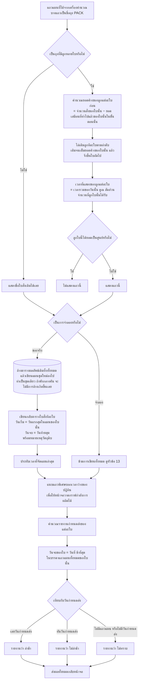

### ตัวอย่างการแตกยอด

ถุงหนึ่งมีลูก 3 ใบ ยอดค้าง 10 / 15 / 8 ชิ้น ตามลำดับ วันหนึ่งเครื่องคำนวณจัดให้ถุงนี้ผลิตได้ **20 ชิ้น**
ใช้เวลารวม 400 นาที

| ลูก | ยอดค้าง | ได้รับวันนี้ | เวลาที่แสดง |
|---|---|---|---|
| ใบที่ 1 | 10 | **10** เต็มยอด | 400 × 10÷20 = **200 นาที** |
| ใบที่ 2 | 15 | **10** ที่เหลือ | 400 × 10÷20 = **200 นาที** |
| ใบที่ 3 | 8 | **0** | ไม่แสดงแถว |

วันถัดไป ใบที่ 2 จะเริ่มจากยอดค้างที่เหลือ 5 ชิ้น แล้วจึงไหลต่อไปใบที่ 3

### หมายเหตุวัตถุดิบที่เขียนกลับ

หลังจัดแผนเสร็จ ระบบเขียนข้อความหมายเหตุกลับไปที่ใบสั่ง ตามกติกานี้

| สถานะปุ่ม "วัตถุดิบเข้าแล้ว" | ข้อความที่ได้ |
|---|---|
| ผู้วางแผนกดยืนยันว่า **เข้าแล้ว** | `Material enough` เสมอ |
| ผู้วางแผนกดยืนยันว่า **ยังไม่เข้า** | `Please pull in material` เสมอ |
| **ยังไม่เคยกด (อัตโนมัติ)** | เทียบวันเริ่มจริงกับวันวัตถุดิบ — เริ่มก่อนวัตถุดิบเข้า = `Please pull in material` มิฉะนั้น = `Material enough` |
| ไม่ได้กรอกวันวัตถุดิบไว้เลย | คำนวณจากวันเริ่มอย่างเดียว |

> ⚠️ **ถ้าใบไหนวางไม่ลงจนไม่มีวันจบ ระบบจะ "คงวันเดิมไว้" ไม่ล้างเป็นค่าว่าง**
> ผลคือดูจากคอลัมน์วันจบอย่างเดียวจะเห็นเป็น "ไม่เปลี่ยน" ทั้งที่งานหลุดแผนไปแล้ว
> ต้องดูรายงานงานที่วางไม่ลง (หัวข้อ 12) ควบคู่เสมอ

> **ข้อควรระวัง:** ตารางผลลัพธ์ถูก **ล้างทิ้งทั้งหมดแล้วเขียนใหม่** ทุกครั้งที่จัดแผน
> ไม่มีการเก็บประวัติแผนเก่า ถ้าต้องการเปรียบเทียบแผนก่อนหลัง ต้องส่งออกเก็บไว้เอง

---

## 12. เมื่อวางไม่ลง ระบบบอกอะไรบ้าง

ก่อนหน้านี้ ใบที่วางไม่ลงจะโผล่บนหน้าจอเป็นแค่ขีด `-` ในช่องวันจบ ผู้ใช้ต้องเดาเอาเองว่าเพราะอะไร
ตอนนี้ระบบตอบ 3 ระดับ

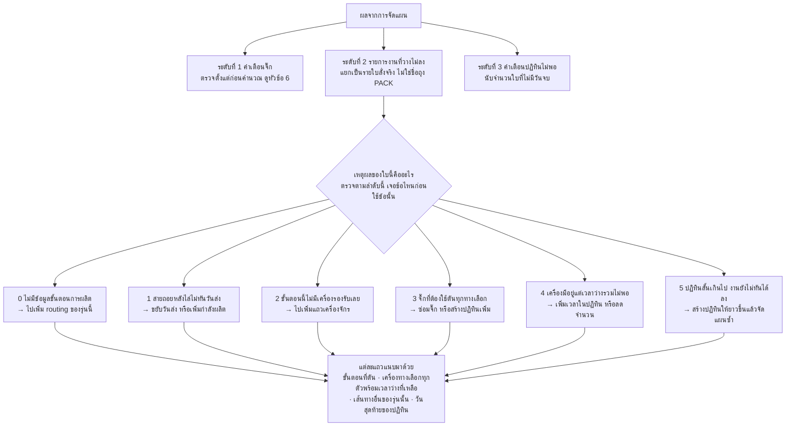

**สิ่งที่ต้องอ่านให้ถูก**

| เรื่อง | ความหมายที่ถูกต้อง |
|---|---|
| **"เครื่องทางเลือก" เป็นรายการเสมอ ไม่เคยเป็นเครื่องเดียว** | เพราะสาเหตุคือ "ไม่มีเครื่องไหนรับได้" ไม่ใช่ "เครื่องนี้รับไม่ได้" การชี้เครื่องเดียวจะทำให้ไปแก้ผิดตัว |
| **ตัวเลข "เลยกำหนดกี่วัน" เป็นค่าต่ำสุดที่รู้ ไม่ใช่ความล่าช้าจริง** | งานที่หลุดแผนไม่มีวันจบเลย จึงคำนวณความล่าช้าจริงไม่ได้ — ตัวเลขนี้วัดจากวันสุดท้ายของปฏิทิน |
| **ไม่มีวันกำหนดส่ง หรือไม่มีปฏิทิน = ไม่มีตัวเลข** | แสดงเป็นค่าว่าง ไม่ใช่ศูนย์ ศูนย์แปลว่า "ตรงวันพอดี" ซึ่งคนละเรื่องกัน |
| **หนึ่งใบสั่งอาจตันหลายขั้นตอน** | ระบบใช้ **ขั้นตอนแรกสุดที่ตัน** เป็นเหตุผลของทั้งใบ เพราะขั้นหลังตันตามขั้นแรกอยู่แล้ว |
| **ใบที่ไม่มีข้อมูลขั้นตอนการผลิต ไม่มีขั้นตอนที่ตันให้ชี้** | เพราะมันไม่เคยเข้าเครื่องคำนวณเลย (หัวข้อ 3) |

**คำเตือน 2 แบบที่ต้องแยกให้ออก**

| แบบ | ถามว่าอะไร | เกิดตอนไหน |
|---|---|---|
| **ปฏิทินไม่พอ** | "จัดแผนรอบนี้มีงานตกไปกี่ใบ" | หลังจัดแผนเสร็จแล้ว — **เกิดขึ้นแล้ว** |
| **ปฏิทินใกล้หมด** | "ปฏิทินเหลืออีกกี่วันจะหมด" | เปิดหน้าจอเมื่อไหร่ก็ถามได้ — **เตือนล่วงหน้า** ระดับเตือนเมื่อเหลือ 30 วัน ระดับวิกฤตเมื่อเหลือ 7 วัน |

> คำเตือน "ปฏิทินใกล้หมด" คำนวณที่ฝั่งเซิร์ฟเวอร์โดยตั้งใจ ไม่ให้หน้าจอไปดูนาฬิกาเครื่องตัวเอง
> เพราะจะกลายเป็นนาฬิกาคนละเรือนกับที่ระบบใช้จัดแผน

---

## 13. จำลองก่อนยืนยัน

ผู้วางแผนสั่งจำลองได้ โดยกดปุ่มเดิม แต่ติดธง "จำลอง" ไปด้วย ผลคือ **เครื่องคำนวณทำงานเต็มรูปแบบ
แต่ไม่มีอะไรถูกเขียนลงฐานข้อมูลเลย**

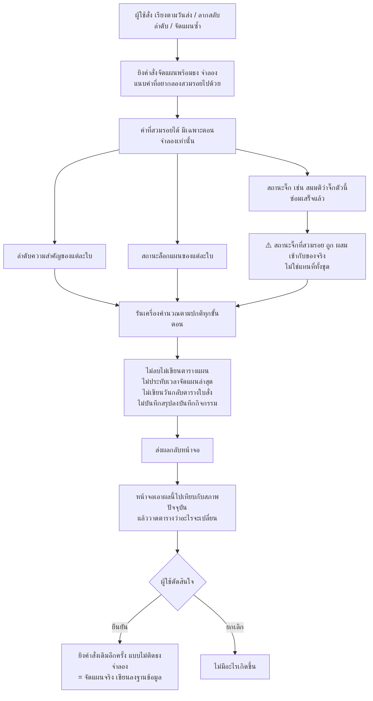

**สิ่งที่ถูกข้ามตอนจำลอง — ครบทุกข้อ**

- ไม่ลบและไม่เขียนตารางผลลัพธ์แผน
- ไม่ประทับเวลา "จัดแผนล่าสุด"
- ไม่เขียน วันเริ่ม / วันจบ / หมายเหตุวัตถุดิบ กลับตารางใบสั่ง
- ไม่อัปเดตธง "ไม่มีข้อมูลขั้นตอนการผลิต" และธง "งานใหม่"
- ไม่บันทึกสรุปการเปลี่ยนแปลงลงบันทึกกิจกรรม

**ทุกอย่างที่เหลือเหมือนกันเป๊ะ** — รายการงานที่วางไม่ลง คำเตือนจิ๊ก คำเตือนปฏิทิน และข้อความสรุป
ออกมาเหมือนการจัดแผนจริงทุกประการ

> ⚠️ **สถานะจิ๊กที่สวมรอย ต้องผสมกับของจริง ห้ามแทนที่ทั้งชุด**
> ถ้าแทนที่ทั้งชุด จิ๊กที่พังอยู่จริงจะหายไปจากการจำลอง งานที่ควรถูกบล็อกจะดูเหมือนเสร็จเร็วขึ้น
> แล้วตารางเปรียบเทียบจะโชว์ "งานเสร็จเร็วขึ้น" ทั้งที่ไม่จริง — พังตรงจุดที่ฟีเจอร์นี้มีไว้แก้พอดี
> ผลพลอยได้ของการผสมคือ การสวมรอยว่าจิ๊กตัวหนึ่ง "พร้อมใช้" จึงมีความหมายว่า
> *"ถ้าซ่อมเสร็จเร็วกว่ากำหนด จะเป็นยังไง"*

> **ตารางเปรียบเทียบก่อน-หลัง คำนวณที่ฝั่งหน้าจอทั้งหมด** ไม่มีปลายทางฝั่งเซิร์ฟเวอร์สำหรับเรื่องนี้
> หน้าจอเอาสภาพปัจจุบันของใบสั่ง มาเทียบกับผลจำลองที่เพิ่งได้

### สรุปการเปลี่ยนแปลงที่ถูกบันทึกไว้

ตอนจัดแผน**จริง** ระบบสรุปให้เองว่ารอบนี้เปลี่ยนอะไรบ้าง แล้วแนบไปกับบันทึกกิจกรรม
เพื่อให้ย้อนกลับมาดูได้ว่า "การจัดแผนซ้ำครั้งนั้นทำอะไรลงไป" ไม่ใช่แค่ "มีคนกดจัดแผนซ้ำ"

- สรุปนี้คำนวณจาก **สิ่งที่เขียนลงฐานข้อมูลจริง** ไม่ใช่ตัวเลขที่หน้าจอส่งขึ้นมา
  (การจำลองกับการจัดแผนจริงเป็นการรันคนละครั้ง ตัวเลขจากหน้าจอจึงไม่ใช่หลักฐาน)
- ⚠️ **จำนวน "หลุดออกจากแผน" นับจากรายการงานที่วางไม่ลง ไม่ใช่จากคอลัมน์วันจบ**
  เพราะใบที่หลุดแผนจะคงวันจบเดิมไว้ (หัวข้อ 11) มองจากคอลัมน์นั้นจะเห็นเป็น "ไม่เปลี่ยน"
- ตัวอย่างรายชื่อในสรุปถูกจำกัดไว้กลุ่มละ 5 ใบ เพราะช่องเก็บรายละเอียดของบันทึกกิจกรรมมีขนาดจำกัด

---

## 14. เปิดแผนล่าสุดขึ้นมาดู

การเปิดดูแผนล่าสุดเป็นคนละทางกับการจัดแผน — มันอ่านจากตารางผลลัพธ์ที่บันทึกไว้ล่าสุดอย่างเดียว
ไม่รันเครื่องคำนวณ

| เรื่อง | รายละเอียด |
|---|---|
| ใครดูได้ | ADMIN, PLANNER และ **MFG** |
| ติดล็อกกันกดซ้อนไหม | **ไม่ติด** เปิดดูได้ตลอด แม้ระหว่างที่คนอื่นกำลังจัดแผน |
| คืนอะไรมาบ้าง | **ตารางแผน + รายงานกำหนดส่ง เท่านั้น** |
| ไม่มีอะไรบ้าง | ข้อความสรุป · รายการงานที่วางไม่ลง · คำเตือนจิ๊ก · คำเตือนปฏิทิน · สรุปการเปลี่ยนแปลง |

> **เปิดหน้าแผนใหม่ทีหลังก็เห็นกราฟกำลังผลิตเหมือนเดิม** — ตอนโหลดแผนล่าสุดขึ้นมาแสดง
> ระบบ**สร้างแถวพิเศษบอกเวลาว่างของปฏิทินขึ้นมาใหม่** จากตารางปฏิทินโดยตรง
> (แถวพวกนี้ไม่ได้ถูกบันทึกลงตารางผลลัพธ์ จึงต้องสร้างซ้ำที่นี่ ถ้าไม่ทำ
> หัวตารางกำลังผลิตจะตกไปใช้ค่าเริ่มต้นที่ไม่ตรงของจริง)

**ผลที่ตามมาที่ต้องรู้:** รายการงานที่วางไม่ลงและคำเตือนต่าง ๆ **เห็นได้เฉพาะตอนที่เพิ่งจัดแผนเสร็จ**
รีเฟรชหน้าจอแล้วจะหายไป ถ้าต้องการดูอีกครั้งต้องจัดแผนซ้ำ (หรือกดจำลอง ซึ่งไม่กระทบแผนจริง)

---

## ตารางค่าคงที่ทั้งหมด

ตัวเลขทุกตัวที่ปรากฏในไดอะแกรมข้างบน สืบกลับมาที่ตารางนี้ได้

**ค่าเหล่านี้แก้ได้ 2 ทาง** — ทางที่ควรใช้คือ **หน้าจอตั้งค่าระบบ** (มีผลทันทีโดยไม่ต้องรีสตาร์ท)
ส่วนไฟล์ตั้งค่าเป็นค่าตั้งต้นเมื่อยังไม่เคยตั้งจากหน้าจอ

| ค่า | ค่าเริ่มต้น | ความหมาย | ใช้ที่หัวข้อ | แก้จากหน้าจอ | ชื่อในไฟล์ตั้งค่า |
|---|---|---|---|---|---|
| เศษเวลาขั้นต่ำที่ใช้งานได้ | **120 นาที** | วันที่เหลือเวลาว่างน้อยกว่านี้ ถือว่าใช้ไม่ได้ | 8, 10 | ✅ | `SCHED_MIN_FRAGMENT_TIME` |
| เวลาตั้งเครื่องแบบประหยัด | **40 นาที** | ใช้เมื่องานก่อนหน้าบนเครื่องเดียวกันใช้**ชุดจิ๊กเดียวกันเป๊ะ** หรือใช้ค่าจริงถ้าน้อยกว่า | 10 | ✅ | `SCHED_MINOR_SETUP_MIN` |
| เกณฑ์ผ่อนผันเปลี่ยนเครื่อง | **60 นาที** | ผลจริงคือทำงานเฉพาะกรณีจบวันเดียวกัน — ดูข้อ 2 ของหัวข้อ 10 | 10 | ✅ | `SCHED_SWITCH_PENALTY_MIN` |
| ช่วงมัดแพ็ค | **30 วัน** | ระยะห่างวันกำหนดส่งสูงสุดที่ยังมัดรวมถุงเดียวกันได้ **วัดจากวันกำหนดส่งปัจจุบันของถุง** | 5 | ✅ | `SCHED_PACK_WINDOW_DAYS` |
| เปิด/ปิด แผนละเอียดงานอบชุบ | **เปิด** | ปิดแล้วงานอบชุบจะคิดแบบวันรอคอยธรรมดา ไม่อิงรอบรถ | 8, 10 | ✅ | `SCHED_ENABLE_HEAT_DEEP_PLAN` |
| เปิด/ปิด กติกาติดเครื่องเดิม | **เปิด** | ปิดแล้วจะไม่เผื่อวันขนย้ายและไม่ดึงกลับเครื่องเดิม | 8, 10 | ✅ | `SCHED_ENABLE_STICKINESS` |
| สัดส่วนงานซ้อนสูงสุด | **1.0** | ⚠️ **ตั้งค่าได้แต่ไม่มีผลกับการคำนวณ** — ดู [ข้อสังเกต](#ข้อสังเกตสำหรับผู้ดูแลระบบ) หัวข้อ “ตั้งค่าได้แต่ไม่ถูกใช้” | — | ✅ | `SCHED_MAX_OVERLAP_PCT` |
| รอบรถขนส่งงานอบชุบ | **จันทร์ / พุธ / ศุกร์** | วันส่งและวันรับต้องตรงรอบเท่านั้น | 8, 10 | ❌ | `SCHED_LOGISTIC_WEEKDAYS` |
| เริ่มวันของโรงงาน | **07:00 น.** | ก่อนเวลานี้ยังนับเป็นวันของเมื่อวาน | 7 | ❌ | `FACTORY_DAY_START_HOUR` (ตัวเดียวที่ไม่มีคำนำหน้า `SCHED_`) |
| กลุ่มงานที่คิดเป็นวัน | **คำสำคัญ 8 คำ** | `PREPARE-OUTSOURCE` (จัดเตรียมส่งนอก), `OUTSOURCE` (ส่งนอก), `HEAT-TREATMENT` (อบชุบ), `HEAT_JUTAWAN` (อบชุบจุฑาวรรณ), `DEBURR-INSEPC` (ลบคม-ตรวจ), `BLACKENING_CCS` (รมดำ), `OQC` (ตรวจสอบขั้นสุดท้าย), `ROUGH_TURNING_CCS` (กลึงหยาบ), `BLACKENING` , `DEBURR-MARK-INSPEC` | 8, 10 | ❌ | `SCHED_DAY_UNIT_KEYWORDS` |
| เปิด/ปิด การมัดแพ็ค | **เปิด** | ปิดแล้วทุกใบสั่งจะถูกจัดแยกกันหมด | 5 | ❌ | `SCHED_ENABLE_PACKING` |
| เตือนปฏิทินใกล้หมด | **30 วัน** | เหลือน้อยกว่านี้ขึ้นคำเตือน | 12 | ❌ | `SCHED_CALENDAR_WARN_DAYS` |
| เตือนปฏิทินวิกฤต | **7 วัน** | เหลือน้อยกว่านี้ขึ้นคำเตือนระดับวิกฤต | 12 | ❌ | `SCHED_CALENDAR_CRITICAL_DAYS` |
| คิวฉุกเฉินของงานค้าง | **ลำดับ −999** | ป้ายของงานที่เริ่มผลิตแล้ว | 7 | ❌ | ฝังในโค้ด |

**ค่าพิเศษที่ใช้แทน "ไม่มีวัน"** — เจอค่าเหล่านี้ในตารางแปลว่าไม่ใช่วันจริง

| ค่า | ความหมาย |
|---|---|
| `9999-12-31` | ยังไม่มีวัน / ไกลสุดขอบ |
| `2099-12-31` | ไม่ได้กรอกวันกำหนดส่ง ใช้ค่านี้แทนตอนเรียงคิว |
| `NO_CAPACITY` | สายเดินหน้าหาเครื่องลงไม่ได้ |
| `OVERDUE` | สายถอยหลังไล่ไม่ทันวันส่ง |
| `CONFIG_ERROR` | ข้อมูลตั้งค่าของขั้นตอนไม่ครบ |
| `_META_CAPACITY_` | ไม่ใช่งาน แต่เป็นแถวบอกเวลาว่างของปฏิทินสำหรับวาดกราฟ |

ชื่อเครื่องที่ **มีคำสำคัญกลุ่ม "งานคิดเป็นวัน" อยู่ในชื่อ** จะถูกจัดเป็นงานที่คิดเป็นวันโดยอัตโนมัติ
ไม่ต้องตั้งค่าเพิ่ม — และนั่นแปลว่า **การตั้งชื่อเครื่องมีผลต่อวิธีคำนวณ**

> ⚠️ **การแก้ค่าเหล่านี้เปลี่ยนผลลัพธ์ทั้งกระดาน** ควรแก้เมื่อตั้งใจจริงเท่านั้น
> และการแก้ค่าจากหน้าจอจะประทับเวลา "แผนถูกแก้ล่าสุด" ให้ด้วย เพื่อบอกว่าแผนที่มีอยู่เก่าไปแล้ว

---

## ข้อสังเกตสำหรับผู้ดูแลระบบ

รายการต่อไปนี้เป็นพฤติกรรมที่ **อ่านโค้ดแล้วดูเหมือนข้อผิดพลาด แต่เป็นสิ่งที่ตั้งใจ**
ทุกข้อเขียนเป็น "พฤติกรรม → ทำไมถึงเป็นแบบนี้ → ถ้าจะแก้ต้องยอมรับอะไร"
**อย่าเผลอ "แก้ให้ถูก" โดยไม่ถามเจ้าของระบบก่อน**

**1. ใบที่ล็อกแผน คืนเวลาเข้าปฏิทินแล้วไม่หักออกซ้ำ**
ตอนจัดแผนซ้ำ ระบบ *เพิ่ม* เวลาที่ใบล็อกแผนเคยใช้ **กลับเข้าปฏิทิน** แล้วคัดลอกแถวแผนเดิม
มาใช้ **โดยไม่หักเวลาออกอีกครั้ง** → กำลังการผลิตของวันนั้นในการคำนวณ จะมากกว่าที่ตั้งไว้จริง
*ถ้าแก้:* ใบที่ล็อกแผนจะกินโควตา แผนของใบอื่นจะเลื่อนออกทั้งกระดาน

**2. "วันแรกที่ปฏิทินเปิด" คิดจากเครื่องตัวเดียว**
ค่าที่ใช้เป็นวันเริ่มต้นของสายเดินหน้า คำนวณจาก **เครื่องตัวแรกที่เจอในปฏิทินเท่านั้น**
ไม่ได้มองครบทุกเครื่อง → ถ้าเครื่องแต่ละตัวมีช่วงวันที่ในปฏิทินไม่เท่ากัน ผลอาจเพี้ยน
*ถ้าแก้:* ต้องนิยามใหม่ว่า "วันแรก" คือวันแรกของเครื่องไหน แล้วผลลัพธ์จะขยับ

**3. ลำดับการประมวลผลเปลี่ยนผลลัพธ์ทั้งกระดาน**
สายถอยหลังกินกำลังการผลิตก่อนสายเดินหน้า และภายในสายเดียวกัน ใบที่คิวมาก่อนได้เลือกเครื่องก่อน
นอกจากนี้ระบบยัง **จำชุดจิ๊กล่าสุดของแต่ละเครื่องข้ามใบสั่ง** (สำหรับคิดเวลาตั้งเครื่องแบบประหยัด)
→ **การสลับลำดับความสำคัญของใบเดียว อาจทำให้แผนเปลี่ยนทั้งกระดาน** ไม่ใช่ความไม่เสถียรของระบบ

**4. ตอนอ่านแผนครั้งก่อน ระบบลองอ่านวันที่แบบ วัน/เดือน/ปี ก่อน**
ถ้าไม่ตรงรูปแบบจึงใช้ค่าเดิม — เป็นการรองรับข้อมูลเก่าที่บันทึกไว้คนละรูปแบบ

**5. สูตรยอดเสมือน ไล่ขั้นตอนตาม "หมายเลขเส้นทาง" ไม่ใช่ "ลำดับขั้น"**
ผลลัพธ์ของสูตรไม่ขึ้นกับลำดับอยู่แล้ว จึงไม่มีผลเสีย แต่ถ้าอ่านโค้ดแล้วสงสัย นี่คือคำตอบ

**6. "วันนี้" ที่ใช้ตั้งวันปล่อยงาน เป็นวันตามปฏิทิน ไม่ใช่วันของโรงงานที่ตัดรอบ 07:00**
สองที่นี้ใช้นิยามวันคนละแบบโดยตั้งใจ → ระหว่างเที่ยงคืนถึง 07:00 น. ทั้งสองค่าจะต่างกัน 1 วัน

**7. ⚠️ ตารางค่าตั้งระบบไม่มีตัวป้องกันแบบตารางอื่น**
ตารางและคอลัมน์ที่สร้างด้วยมือทุกตัวถูกตรวจก่อนอ่าน **ยกเว้นตารางค่าตั้งระบบ** ที่อ่านตรง ๆ
→ เครื่องที่ยังไม่ได้รันสคริปต์สร้างตาราง **จัดแผนไม่ได้เลย ระบบตอบข้อผิดพลาด**
ไม่ใช่แค่ "หน้าตั้งค่าเซฟไม่ได้" ตามที่หน้าตรวจสอบโครงสร้างฐานข้อมูลรายงานไว้
*ต้องทำอะไร:* ตรวจให้แน่ใจว่าเครื่องใหม่ทุกเครื่องรันสคริปต์ครบก่อนใช้งาน

**8. ⚠️ สายถอยหลังไม่ตรวจจิ๊กพัง**
การบล็อกด้วยจิ๊กมีอยู่ที่เดียวคือตอนไล่ปฏิทินของ**สายเดินหน้า** สายถอยหลังไม่ตรวจ
→ งานที่ผู้ใช้ตั้งให้วางถอยหลัง อาจถูกวางลงวันที่จิ๊กใช้ไม่ได้
(การตรวจล่วงหน้าในหัวข้อ 6 ยังจับได้เฉพาะกรณีที่จิ๊กตันยาวจนถึงปลายปฏิทินเท่านั้น)

**9. เกณฑ์ผ่อนผัน 60 นาที ในทางปฏิบัติคือ "จบวันเดียวกันเท่านั้น"**
ระบบเทียบเวลาจบงานกันในหน่วยวัน สองวันที่ต่างกันจึงห่างกันอย่างน้อย 1 วันเต็ม
ซึ่งมากกว่า 60 นาทีเสมอ → เงื่อนไขนี้เป็นจริงได้เฉพาะตอนจบวันเดียวกันเป๊ะ
*ถ้าแก้ให้เทียบละเอียดระดับนาทีจริง:* งานจะเกาะเครื่องเดิมมากขึ้น แผนเปลี่ยนทั้งกระดาน

**10. "สัดส่วนงานซ้อนสูงสุด" ตั้งค่าได้แต่ไม่ถูกใช้**
หน้าจอให้แก้ได้และระบบอ่านค่าขึ้นมาจริง แต่ไม่ได้ส่งต่อให้เครื่องคำนวณ (จงใจ ตอนย้ายระบบ)
→ แก้ค่านี้แล้วแผนไม่เปลี่ยน อย่าเสียเวลาไล่หาว่าทำไม

**11. คำว่า "จำลอง" ในโค้ดมี 2 ความหมายคนละเรื่อง**
ตัวหนึ่งคือ "จำลองทั้งการจัดแผน ไม่เขียนฐานข้อมูล" (หัวข้อ 13)
อีกตัวคือ "รอบทดลองเพื่อเลือกเส้นทางที่ดีที่สุด" ภายในเครื่องคำนวณ (หัวข้อ 9)
→ อ่านโค้ดแล้วเจอชื่อนี้ ต้องดูให้ดีว่าเป็นตัวไหน
ผลอย่างหนึ่งที่ตามมา: **รายการงานที่วางไม่ลงจะรายงานเฉพาะรอบที่ใช้จริง**
ไม่รวมเส้นทางที่ถูกทดลองแล้วทิ้ง — ซึ่งถูกต้องแล้ว

**12. ข้อความสถานะของแต่ละใบสั่ง ใช้ถ้อยคำเดิมทุกตัวอักษร**
เป็นค่าที่หน้าจอและรายงานเทียบตรง ๆ การแก้ข้อความจึงพังหน้าจอโดยไม่มีข้อความผิดพลาด

---

## แผนที่โค้ดสำหรับผู้ดูแลระบบ

*(หัวข้อเดียวในเอกสารนี้ที่อ้างชื่อไฟล์ — ทุกเส้นทางนับจาก `backend/` ยกเว้นที่ระบุไว้เป็นอย่างอื่น)*

### หน้าที่ของแต่ละไฟล์

| ไฟล์ | หน้าที่ |
|---|---|
| `routes/schedule.js` | ปลายทาง 3 ตัว: จัดแผน, จัดแผนซ้ำ, เปิดแผนล่าสุด + สิทธิ์ + ล็อกกันกดซ้อน |
| `services/schedulerService.js` | ตัวประสานงาน: อ่านฐานข้อมูล → เรียกเครื่องคำนวณ → บันทึกผล **(ไฟล์เดียวที่คุยกับฐานข้อมูล)** |
| `scheduler/planBuilder.js` | เตรียมข้อมูลก่อน และแปลงผลหลังเครื่องคำนวณ |
| `scheduler/orderManager.js` | มัดแพ็คและจัดคิวใบสั่ง |
| `scheduler/configProcessor.js` | แปลงตารางขั้นตอน/เครื่องจักรเป็นตารางค้นหา |
| `scheduler/engine.js` | เครื่องคำนวณหลัก |
| `scheduler/machineFilter.js` | คัดเครื่องที่ปิดใช้งานออก + เรียงเลขทางเลือกใหม่ |
| `scheduler/jigBlocks.js` | ช่วงวันที่จิ๊กใช้ไม่ได้ + กติกาชุดจิ๊กหลายตัว |
| `scheduler/dayUnit.js` | ทดสอบว่าเป็นงานที่คิดเป็นวันหรือไม่ |
| `scheduler/pyUtils.js` | ตัวช่วยให้ผลลัพธ์ตรงกับภาษาต้นทาง |
| `config/constants.js` | ค่าคงที่ทั้งหมด |
| `utils/dates.js` | นาฬิกาไทย วันของโรงงาน และตัวช่วยเรื่องวันที่ |
| `utils/calendarHorizon.js` | คำเตือนปฏิทินใกล้หมด |
| `state/planLock.js` · `state/timestamps.js` | ล็อกกันจัดแผนซ้อน · ตราเวลาแผนล่าสุด |

> ⚠️ **`scheduler/` ต้องบริสุทธิ์ ห้ามเรียกฐานข้อมูลหรือนาฬิกาโดยเด็ดขาด** เวลาปัจจุบันถูกฉีดเข้าไปเสมอ
> นี่คือสิ่งที่ทำให้ทดสอบซ้ำกี่รอบก็ได้ผลเดิม และทดสอบได้โดยไม่ต้องต่อฐานข้อมูลโรงงาน

### หัวข้อในเอกสาร → ฟังก์ชันในโค้ด

| หัวข้อ | ไฟล์ | ฟังก์ชัน |
|---|---|---|
| 1 ปลายทางและสิทธิ์ | `routes/schedule.js` | ตัวจัดการของ `/run`, `/replan`, `/latest` |
| 1 ล็อกกันกดซ้อน | `state/planLock.js` | `tryAcquire` / `release` |
| 1–2 ลำดับงานทั้งหมด | `services/schedulerService.js` | `run` |
| 2 อ่านตารางข้อมูลหลัก + ตัวตรวจตารางที่สร้างด้วยมือ | `services/schedulerService.js` | `loadInputs` |
| 2 แปลงตารางเครื่องจักรเป็นตัวเลือกเครื่อง | `scheduler/configProcessor.js` | `processRouting` / `processUnifiedMachineConfig` |
| 3 เตรียมใบสั่ง วันพร้อมเริ่มจริง วัตถุดิบเข้า | `scheduler/planBuilder.js` | `buildRawOrders` |
| 3 คัดใบที่ไม่มีข้อมูลขั้นตอนการผลิต | `scheduler/planBuilder.js` | `rejectMissingRouting` |
| **4 ยอดผู้รอดชีวิตและยอดเสมือน** | `scheduler/planBuilder.js` | **`buildFakeActuals`** |
| 5 กุญแจมัดแพ็คและช่วง 30 วัน | `scheduler/orderManager.js` | `packOrders` (แปลงข้อมูลเข้าที่ `parseRawInput`) |
| 5 จัดคิว | `scheduler/orderManager.js` | `sortForScheduler` |
| 6 คัดเครื่องที่ปิดใช้งาน + เรียงเลขทางเลือกใหม่ | `scheduler/machineFilter.js` | `filterActiveMachines` |
| 6 ตารางช่วงวันที่จิ๊กใช้ไม่ได้ | `scheduler/jigBlocks.js` | `buildJigBlockMap` / `isBlockedThroughHorizon` |
| 6 กติกาชุดจิ๊กหลายตัว | `scheduler/jigBlocks.js` | `normalizeJigList` / `jigSetKey` / `isAnyJigBlocked` |
| 6 ตรวจล่วงหน้า + ข้อความเตือนจิ๊ก | `scheduler/planBuilder.js` | `findBlockedSteps` / `blockedStepsMessage` |
| 7 ปรับปฏิทิน + วันแรกของปฏิทิน + แยก 3 สาย | `scheduler/engine.js` | `run` (ช่วงต้นของเมท็อด) |
| 7 วันของโรงงาน และนาฬิกาไทย | `utils/dates.js` | `nowBangkok` / `getFactoryDate` / `getElapsedMinutes` |
| **8 สายถอยหลัง ระดับขั้นตอน** | `scheduler/engine.js` | **`simulateBackwardFlow`** |
| 8 สายถอยหลัง ระดับเลือกเส้นทาง | `scheduler/engine.js` | `run` (ลูปสายถอยหลัง) |
| 8, 10 รอบรถ จันทร์ พุธ ศุกร์ | `scheduler/engine.js` | `findNextLogisticRound` / `findPreviousLogisticRound` |
| **9 เลือกเส้นทางของสายเดินหน้า** | `scheduler/engine.js` | **`run`** (ลูปสายเดินหน้า) + `buildFlowConfig` |
| **10 ไล่ทีละขั้นตอน** | `scheduler/engine.js` | **`performActualPlanning`** |
| 10 เวลาตั้งเครื่องแบบประหยัด | `scheduler/engine.js` | `getSmartSetupTime` |
| 10 กฎตั้งเครื่องใหม่เมื่อมีงานแทรก | `scheduler/engine.js` | `checkInterruption` |
| 10 จิ๊กพังทำให้กำลังผลิตเป็นศูนย์ | `scheduler/engine.js` | `isJigSetBlocked` (ถูกเรียกที่เดียวในลูปไล่วัน) |
| 10 งานที่คิดเป็นวัน | `scheduler/dayUnit.js` | `isDayUnitMachine` / `isDayUnitStep` |
| **11 แตกยอดกลับลอทลูก** | `scheduler/planBuilder.js` | **`buildDisplayRows`** (เรียงก่อนด้วย `sortMainPlanForDb`) |
| 11 แถวพิเศษบอกเวลาว่างของปฏิทิน | `scheduler/planBuilder.js` | `cleanDisplayData` |
| 11 ล้างตารางผลลัพธ์แล้วเขียนใหม่ (ชุดเดียว) | `services/schedulerService.js` | `persist` |
| 11 เขียนวันและหมายเหตุกลับตารางใบสั่ง | `scheduler/planBuilder.js` + `services/schedulerService.js` | `computeProgramNote` / `buildOrderDateUpdates` → `persistOrderDates` |
| 11 รายงานกำหนดส่ง | `scheduler/planBuilder.js` | `buildShipmentReport` |
| 11 ประทับเวลาจัดแผนล่าสุด | `state/timestamps.js` | `markPlan` |
| **12 รายงานงานที่วางไม่ลง** | `scheduler/planBuilder.js` | **`buildUnplannedReport`** (ข้อมูลดิบจาก `engine.failedSteps`) |
| 12 คำเตือนปฏิทินไม่พอ | `scheduler/planBuilder.js` | `buildCapacityWarning` |
| 12 คำเตือนปฏิทินใกล้หมด | `utils/calendarHorizon.js` | `summarizeHorizon` |
| 13 สถานะจิ๊กที่สวมรอย (ผสม ไม่ใช่แทนที่) | `scheduler/jigBlocks.js` | `mergeJigOverrides` |
| 13 สรุปการเปลี่ยนแปลงลงบันทึกกิจกรรม | `scheduler/planBuilder.js` | `buildPlanChangeSummary` |
| 13 ตารางเปรียบเทียบก่อน-หลัง (ฝั่งหน้าจอ) | `frontend/src/pages/orders/planDiff.js` | `buildPlanDiff` |
| 14 สร้างแถวเวลาว่างของปฏิทินตอนเปิดแผนเก่า | `routes/schedule.js` | ตัวจัดการของ `/latest` |
| ค่าคงที่ทั้งหมด | `config/constants.js` | — |
| ค่าที่แก้จากหน้าจอ | `routes/system.js` | ปลายทาง `GET`/`PUT` ของ `/system/settings` |
| กติกาการย้ายโค้ดทั้ง 13 ข้อ | `scheduler/engine.js` | คอมเมนต์หัวไฟล์ |

### ชุดทดสอบ

| ทดสอบอะไร | คำสั่ง / ที่อยู่ |
|---|---|
| ทั้งหมด | `cd backend && npm test` |
| เทียบผลกับเครื่องคำนวณตัวเดิม | `node --test scheduler/__tests__/parity.test.js` |
| กฎที่เพิ่มมาทีหลัง | `scheduler/__tests__/` — `orderManager.test.js`, `planBuilder.test.js`, `engine.smoke.test.js`, `jigBlocks.test.js`, `machineFilter.test.js` |
| ตัวสร้างข้อมูลตัวอย่างเทียบผล | `tools/parity/` **ที่ root ของ repo ไม่ใช่ใต้ `backend/`** (ต้องรันบนเครื่องที่มี Python + ระบบเดิม) |

> **ทุกฟังก์ชันใน `scheduler/` มีคอมเมนต์ระบุช่วงบรรทัดของโค้ดต้นทางไว้ให้เทียบทีละบรรทัด**
> และเมื่อแก้เสร็จ **ต้องรันชุดทดสอบเทียบผลทุกครั้ง** — ชุดนี้คือหลักฐานว่าตรรกะการวางแผนยังให้ผลตรงเดิม
